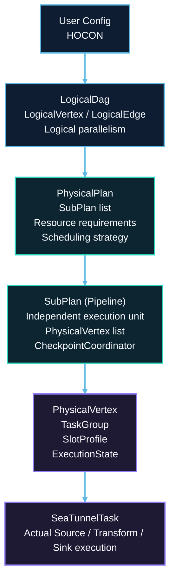
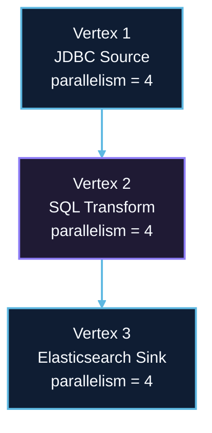
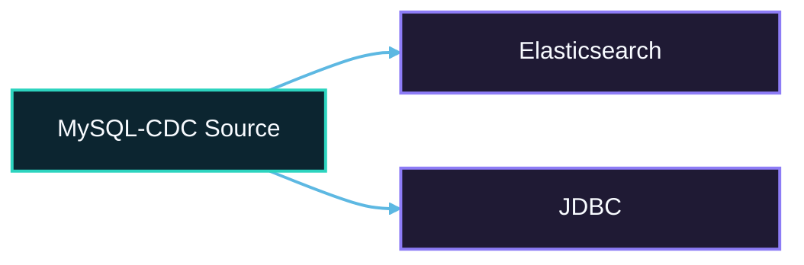
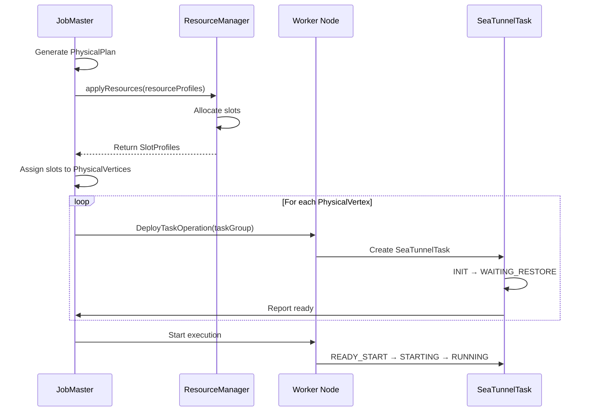

# DAG Execution Model

## 1. Overview

### 1.1 Problem Background

Distributed data processing requires transforming user intentions into executable distributed tasks:

- **Abstraction Levels**: How to separate logical intent from physical execution?
- **Optimization**: How to optimize task placement and data shuffling?
- **Pipeline**: How to execute complex DAGs with multiple sources/sinks?
- **Parallelism**: How to determine task parallelism and distribution?
- **Fault Isolation**: How to limit failure impact to affected components?

### 1.2 Design Goals

SeaTunnel's DAG execution model aims to:

1. **Separate Concerns**: Logical planning (user intent) vs physical execution (runtime details)
2. **Enable Optimization**: Task fusion, pipeline分割, resource allocation
3. **Support Complex Topologies**: Multiple sources, sinks, branches, joins
4. **Facilitate Fault Tolerance**: Clear failure boundaries with independent checkpoints
5. **Maximize Parallelism**: Efficient parallel execution with minimal coordination

### 1.3 Execution Model Overview



## 2. LogicalDag: User Intent

### 2.1 Structure

LogicalDag represents the user's job configuration in an engine-independent way.

```java
public class LogicalDag {
    // Vertices: Source, Transform, Sink actions
    private final Map<Long, LogicalVertex> logicalVertexMap;

    // Edges: Data flow dependencies
    private final Set<LogicalEdge> edges;

    // Job configuration
    private final JobConfig jobConfig;
}
```

### 2.2 LogicalVertex

Represents a single action (Source/Transform/Sink) with parallelism.

```java
public class LogicalVertex {
    private final long vertexId;
    private final Action action; // SourceAction, TransformChainAction, SinkAction
    private final int parallelism; // Number of parallel instances
}
```

**Action Types**:
- **SourceAction**: Wraps `SeaTunnelSource`, produces `CatalogTable`
- **TransformChainAction**: Chain of `SeaTunnelTransform`, transforms schema
- **SinkAction**: Wraps `SeaTunnelSink`, consumes `CatalogTable`

**Example**:
```java
// From config:
// source { JDBC { ... parallelism = 4 } }
// transform { Sql { ... parallelism = 8 } }
// sink { Elasticsearch { ... parallelism = 2 } }

LogicalVertex sourceVertex = new LogicalVertex(
    vertexId: 1,
    action: new SourceAction(jdbcSource),
    parallelism: 4
);

LogicalVertex transformVertex = new LogicalVertex(
    vertexId: 2,
    action: new TransformChainAction(sqlTransform),
    parallelism: 8
);

LogicalVertex sinkVertex = new LogicalVertex(
    vertexId: 3,
    action: new SinkAction(esSink),
    parallelism: 2
);
```

### 2.3 LogicalEdge

Represents data flow between actions.

```java
public class LogicalEdge {
    private final long inputVertexId;   // Upstream vertex
    private final long targetVertexId;  // Downstream vertex
}
```

**Example**:
```java
// Source → Transform edge
LogicalEdge edge1 = new LogicalEdge(
    inputVertexId: 1,  // JDBC Source
    targetVertexId: 2  // SQL Transform
);

// Transform → Sink edge
LogicalEdge edge2 = new LogicalEdge(
    inputVertexId: 2,  // SQL Transform
    targetVertexId: 3  // Elasticsearch Sink
);
```

### 2.4 LogicalDag Creation

Built from user configuration:

```java
// JobMaster creates LogicalDag
LogicalDag logicalDag = LogicalDagGenerator.generate(jobConfig);
```

**Process**:
1. Parse HOCON config (source, transform, sink sections)
2. Create `Action` objects for each configured component
3. Infer data flow from config structure
4. Validate schema compatibility
5. Build `LogicalDag` object

**Example Config → LogicalDag**:
```hocon
env {
  parallelism = 4
}

source {
  JDBC {
    url = "jdbc:mysql://..."
    query = "SELECT * FROM orders"
  }
}

transform {
  Sql {
    query = "SELECT order_id, SUM(amount) FROM this GROUP BY order_id"
  }
}

sink {
  Elasticsearch {
    hosts = ["es-host:9200"]
    index = "orders_summary"
  }
}
```

Generated LogicalDag:


## 3. PhysicalPlan: Execution Strategy

### 3.1 Structure

PhysicalPlan describes how to execute the LogicalDag on distributed workers.

```java
public class PhysicalPlan {
    // Multiple pipelines (SubPlans)
    private final List<SubPlan> pipelineList;

    // Immutable job information
    private final JobImmutableInformation jobImmutableInformation;

    // Distributed state (Hazelcast IMap)
    private final IMap<Long, JobStatus> runningJobStateIMap;
    private final IMap<Long, Long> runningJobStateTimestampsIMap;

    // Job completion future
    private final CompletableFuture<JobResult> jobEndFuture;
}
```

### 3.2 Pipeline Splitting

A LogicalDag is split into multiple **Pipelines** (SubPlans) by the current `PipelineGenerator` implementation:

1. **Unrelated Subgraphs**: Disconnected parts of the DAG become independent pipelines
2. **Multiple-Input Vertices**: If a connected subgraph contains a vertex with multiple upstream inputs, the generator splits the subgraph into multiple linear pipelines along each source→sink path and clones vertices where needed

**Note**: Multiple sinks (branching) do not necessarily create multiple pipelines. When there is no multiple-input vertex, a branching graph is usually kept as a single pipeline.

**Example 1: Simple Linear Pipeline**:
```hocon
source { JDBC { } }
transform { Sql { } }
sink { Elasticsearch { } }
```

Generated: **1 Pipeline**
Generated result:

- `Pipeline 1`: `JDBC Source → SQL Transform → Elasticsearch Sink`

**Example 2: Multiple Sources**:
```hocon
source {
    JDBC { plugin_output = "orders" }
    Kafka { plugin_output = "events" }
}

transform {
  Sql { query = "SELECT * FROM orders UNION SELECT * FROM events" }
}

sink {
  Elasticsearch { }
}
```

Generated: **2 Pipelines**
Generated result:

- `Pipeline 1`: `JDBC Source → SQL Transform → Elasticsearch Sink`
- `Pipeline 2`: `Kafka Source → SQL Transform → Elasticsearch Sink`

**Example 3: Multiple Sinks**:
```hocon
source {
  MySQL-CDC { }
}

sink {
    Elasticsearch { plugin_input = "MySQL-CDC" }
    JDBC { plugin_input = "MySQL-CDC" }
}
```

Generated: **1 Pipeline**
Generated result:



### 3.3 PhysicalPlan Generation

```java
// In JobMaster
PhysicalPlan physicalPlan = new PhysicalPlanGenerator(logicalDag, resourceManager)
    .generate();
```

**Steps**:
1. **Analyze LogicalDag**: Identify sources, sinks, and dependencies
2. **Split into Pipelines**: Create SubPlan for each pipeline
3. **Generate PhysicalVertices**: Create parallel instances for each action
4. **Allocate Resources**: Request slots from ResourceManager
5. **Assign Tasks**: Map PhysicalVertices to slots
6. **Create Coordinators**: Setup CheckpointCoordinator per pipeline

## 4. SubPlan (Pipeline)

### 4.1 Structure

SubPlan represents an independently executing pipeline.

```java
public class SubPlan {
    private final int pipelineId;
    private final PipelineLocation pipelineLocation;

    // All task instances in this pipeline
    private final List<PhysicalVertex> physicalVertexList;

    // Coordinator tasks (Enumerator, Committer)
    private final List<PhysicalVertex> coordinatorVertexList;

    // Checkpoint coordinator for this pipeline
    private final CheckpointCoordinator checkpointCoordinator;

    // Execution state
    private PipelineStatus pipelineStatus;
}
```

### 4.2 PhysicalVertex List

Each LogicalVertex with parallelism N generates N PhysicalVertices.

**Example**:
| Logical vertex | Generated physical vertices |
|----------------|-----------------------------|
| `JDBC Source (parallelism = 4)` | `PhysicalVertex` subtask `0` on slot `1`, subtask `1` on slot `2`, subtask `2` on slot `3`, subtask `3` on slot `4` |

### 4.3 Coordinator Vertices

Special vertices for coordination tasks:

- **SourceSplitEnumerator**: Usually runs as a single coordination instance that assigns splits to readers (deployment is engine-specific)
- **SinkAggregatedCommitter**: When a sink provides an aggregated committer, it usually runs as a single coordination instance for global commit orchestration (deployment is engine-specific)

Note: `SinkCommitter` depends on the execution engine and does not necessarily appear as an independent coordinator vertex. In SeaTunnel Engine, for example, the committer can be triggered inside the sink task's checkpoint callback.

**Example**:
| Runtime scope | Instances |
|---------------|-----------|
| `physicalVertexList` | `JdbcSourceTask × 4`, `TransformTask × 4`, `ElasticsearchSinkTask × 4` |
| `coordinatorVertexList` | `JdbcSourceSplitEnumerator × 1`, plus `ElasticsearchSinkAggregatedCommitter × 1` (optional) |

### 4.4 Independent Checkpointing

Each pipeline has its own `CheckpointCoordinator`:

**Benefits**:
- Independent checkpoint intervals
- Isolated failure domains
- Reduced coordination overhead
- Simpler barrier alignment

**Example**:
| Pipeline | Checkpoint behavior |
|----------|---------------------|
| `Pipeline 1 (JDBC → ES)` | A `CheckpointCoordinator` triggers every `60s` and manages only JDBC and Elasticsearch tasks |
| `Pipeline 2 (Kafka → JDBC)` | A separate coordinator can trigger every `30s` and manages only Kafka and JDBC tasks |

## 5. PhysicalVertex: Deployed Task

### 5.1 Structure

PhysicalVertex represents a deployed task instance.

```java
public class PhysicalVertex {
    private final TaskGroupLocation taskGroupLocation;
    private final TaskGroupDefaultImpl taskGroup;

    // Assigned resource slot
    private final SlotProfile slotProfile;

    // Execution state (CREATED, RUNNING, FAILED, etc.)
    private ExecutionState currentExecutionState;

    // Plugin jars (for class loader isolation)
    private final List<Set<URL>> pluginJarsUrls;
}
```

### 5.2 TaskGroup: Task Fusion

Multiple tasks can be fused into a single `TaskGroup` for efficiency.

```java
public class TaskGroupDefaultImpl implements TaskGroup {
    private final TaskGroupLocation taskGroupLocation;

    // Multiple tasks in this group
    private final Set<Task> tasks;

    // Shared thread pool
    private final ExecutorService executorService;

    // Shared network buffers
    private final Map<Long, BlockingQueue<Record<?>>> internalChannels;
}
```

**Fusion Conditions**:
1. Same parallelism
2. Sequential dependency (A → B)
3. No data shuffle required

**Example (with fusion)**:
| Mode | Execution shape | Impact |
|------|-----------------|--------|
| Logical DAG | `Source (4) → Transform (4) → Sink (4)` | Same business topology in both modes |
| Without fusion | `12` separate tasks with network hops between stages | Higher serialization and network overhead |
| With fusion | `4` task groups, each containing `SourceTask → TransformTask → SinkTask` | Lower network cost and better locality |

**Benefits**:
- Reduced network serialization/deserialization
- Better CPU cache locality
- Lower memory footprint
- Simplified deployment

### 5.3 Slot Assignment

Each PhysicalVertex is assigned a `SlotProfile`:

```java
public class SlotProfile {
    private final long slotID;
    private final Address workerAddress;
    private final ResourceProfile resourceProfile; // CPU, memory
}
```

**Assignment Process**:
1. JobMaster requests slots from ResourceManager
2. ResourceManager selects workers based on strategy (random, slot ratio, load)
3. ResourceManager allocates slots and returns SlotProfiles
4. JobMaster assigns SlotProfiles to PhysicalVertices
5. JobMaster deploys tasks via `DeployTaskOperation`

## 6. Task Deployment and Execution

### 6.1 Deployment Flow



### 6.2 Task Execution

Each `SeaTunnelTask` executes its assigned action:

**SourceSeaTunnelTask**:
```java
while (isRunning()) {
    // Poll data from SourceReader
    sourceReader.pollNext(collector);

    // Handle checkpoint barriers
    if (checkpointTriggered) {
        triggerBarrier(checkpointId);
    }
}
```

**TransformSeaTunnelTask**:
```java
while (isRunning()) {
    // Read from input queue
    Record record = inputQueue.take();

    // Apply transform
    Record transformed = transform.map(record);

    // Write to output queue
    outputQueue.put(transformed);
}
```

**SinkSeaTunnelTask**:
```java
while (isRunning()) {
    // Read from input queue
    Record record = inputQueue.take();

    // Write to sink
    sinkWriter.write(record);

    // Handle checkpoint barriers
    if (barrierReceived) {
        commitInfo = sinkWriter.prepareCommit(checkpointId);
        snapshotState(checkpointId);
    }
}
```

## 7. Optimization Strategies

### 7.1 Task Fusion

**When to Fuse**:
- Same parallelism
- Sequential operators (no branching)
- No shuffle boundary

**When NOT to Fuse**:
- Different parallelism (e.g., source=4, sink=8)
- Branching DAG (one source, multiple sinks)
- Shuffle required (e.g., GROUP BY, JOIN)

Task fusion behavior and controls are engine-implementation specific. Avoid relying on undocumented `env.job.mode` values in architecture examples.

### 7.2 Parallelism Inference

Parallelism resolution (SeaTunnel Engine / Zeta):

- If an action/connector config specifies `parallelism`, it takes precedence
- Otherwise use `env.parallelism` (default is `1`)

**Example**:
```hocon
env { parallelism = 1 }

source {
  JDBC { parallelism = 4 }  # Explicit
}

transform {
  Sql { }  # Inferred: 4 (from source)
}

sink {
  Elasticsearch { }  # Inferred: 4 (from transform)
}
```

### 7.3 Resource Allocation

**Slot Calculation**:
Slot sizing rule:

- `Required slots = sum of all task parallelism`
- Example without fusion: `Source (4) + Transform (4) + Sink (2) = 10 slots`
- Example with fusion: `TaskGroup (4, Source+Transform fused) + Sink (2) = 6 slots`

**Resource Profile**:
```java
ResourceProfile profile =
    new ResourceProfile(
        CPU.of(1),                // 1 CPU core
        Memory.of(512 * 1024 * 1024L) // 512MB heap (bytes)
    );
```

## 8. Failure Handling

### 8.1 Task Failure

**Detection**:
- Task throws exception
- Heartbeat timeout

**Recovery**:
1. Mark task as FAILED
2. Fail entire pipeline (conservative)
3. Restore from latest checkpoint
4. Reallocate resources
5. Redeploy and restart pipeline

### 8.2 Pipeline Failure Isolation

**Key Insight**: Pipeline failures are isolated.

**Example**:
| Pipeline | State | Recovery outcome |
|----------|-------|------------------|
| `Pipeline 1` | `RUNNING` | Keeps running |
| `Pipeline 2` | `FAILED` | Restarts from the latest checkpoint |

The key point is isolation: one failed pipeline does not automatically stop unrelated healthy pipelines.

**Benefits**:
- Reduced blast radius
- Faster recovery (only failed pipeline)
- Better resource utilization

## 9. Monitoring and Observability

### 9.1 Key Metrics

**Pipeline-Level**:
- Pipeline status and lifecycle transitions (CREATED / RUNNING / FINISHED / FAILED)
- Task counts and placement across workers/slots
- Checkpoint progress (latest checkpoint id, duration, failures)

**Task-Level**:
- Task status and restart counters
- Record/byte throughput (in/out)
- Backpressure / queueing indicators (engine-dependent)

### 9.2 Visualization

| Pipeline | Vertex placement |
|----------|------------------|
| `Pipeline 1 (mysql-cdc → elasticsearch)` | `PhysicalVertex 0 @ worker-1:slot-1`, `1 @ worker-2:slot-1`, `2 @ worker-3:slot-1`, `3 @ worker-4:slot-1` |
| `Pipeline 2 (mysql-cdc → jdbc)` | `PhysicalVertex 0 @ worker-1:slot-2`, `1 @ worker-2:slot-2` |

## 10. Best Practices

### 10.1 Parallelism Configuration

**Rule of Thumb**:
Choose parallelism from the smallest practical bound among:

- data partitions
- available slots
- `target throughput / single-task throughput`

**Examples**:
- **JDBC Source**: Set to number of DB partitions (e.g., 8 partitions → parallelism=8)
- **Kafka Source**: Set to number of partitions (e.g., 32 partitions → parallelism=32)
- **File Source**: Set to number of files or file splits
- **CPU-Intensive Transform**: Set to number of CPU cores
- **I/O-Intensive Sink**: Set based on target system capacity

### 10.2 Pipeline Design

**Keep Pipelines Simple**:
- Prefer linear pipelines (Source → Transform → Sink)
- Avoid complex branching when possible
- Use multiple jobs for completely independent workflows

**Use Multiple Jobs When**:
- Different checkpoint intervals needed
- Different resource requirements
- Independent failure domains desired

### 10.3 Troubleshooting

**Problem**: Tasks not starting

**Check**:
1. Enough available slots? (`required_slots <= available_slots`)
2. Resource profile reasonable? (not requesting 100 CPU cores)
3. Tag filters correct? (if using tag-based assignment)

**Problem**: Low throughput

**Check**:
1. Parallelism too low? (increase parallelism)
2. Task fusion disabled? (enable for better performance)
3. Checkpoint interval too short? (increase interval)

## 11. Related Resources

- [Engine Architecture](engine-architecture.md)
- [Resource Management](resource-management.md)
- [Checkpoint Mechanism](../fault-tolerance/checkpoint-mechanism.md)
- [Architecture Overview](../overview.md)

## 12. References

### Key Source Files

- [LogicalDag.java](../../../../seatunnel-engine/seatunnel-engine-core/src/main/java/org/apache/seatunnel/engine/core/dag/logical/LogicalDag.java)
- [PhysicalPlan.java](../../../../seatunnel-engine/seatunnel-engine-server/src/main/java/org/apache/seatunnel/engine/server/dag/physical/PhysicalPlan.java)
- [SubPlan.java](../../../../seatunnel-engine/seatunnel-engine-server/src/main/java/org/apache/seatunnel/engine/server/dag/physical/SubPlan.java)
- [PhysicalVertex.java](../../../../seatunnel-engine/seatunnel-engine-server/src/main/java/org/apache/seatunnel/engine/server/dag/physical/PhysicalVertex.java)
- [TaskGroupDefaultImpl.java](../../../../seatunnel-engine/seatunnel-engine-server/src/main/java/org/apache/seatunnel/engine/server/execution/TaskGroupDefaultImpl.java)

### Further Reading

- [Google Borg Paper](https://research.google/pubs/pub43438/) - Task scheduling inspiration
- [Apache Flink JobGraph](https://nightlies.apache.org/flink/flink-docs-stable/docs/internals/job_scheduling/)
- [Spark DAG Scheduler](https://spark.apache.org/docs/latest/job-scheduling.html)
