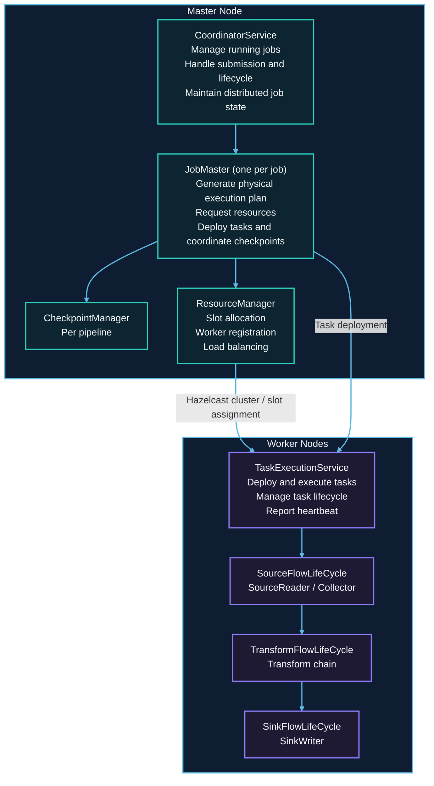
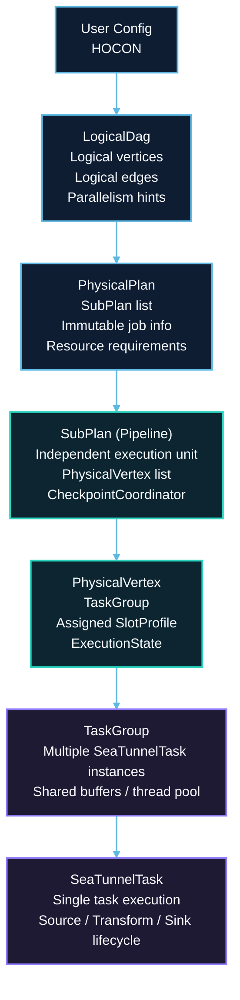
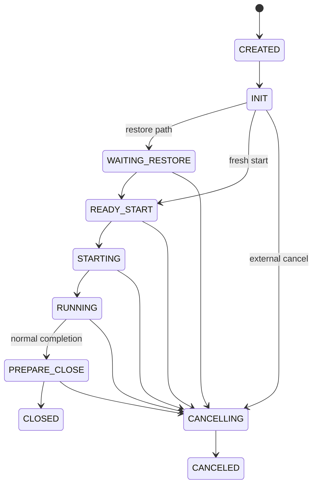
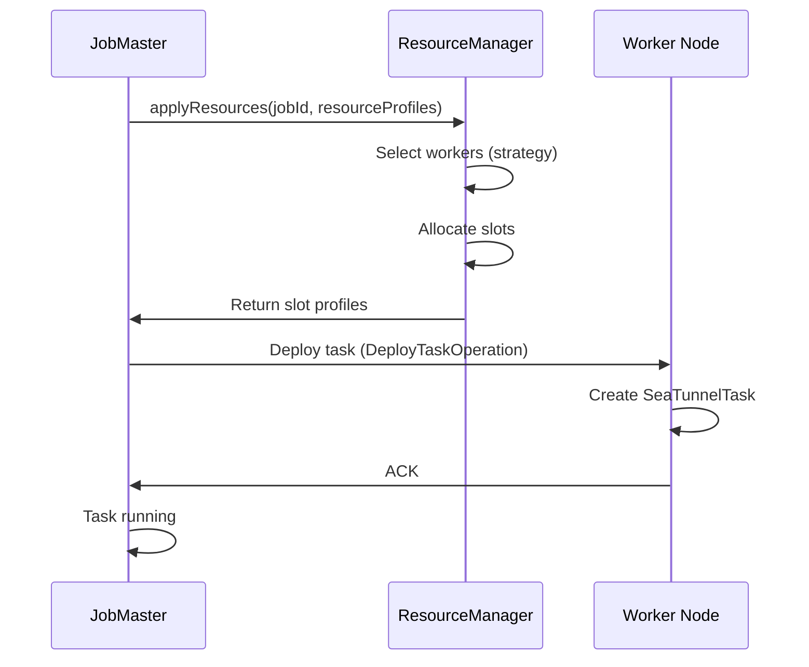

# SeaTunnel Engine (Zeta) Architecture

## 1. Overview

### 1.1 Problem Background

Data integration engines must solve fundamental distributed systems challenges:

- **Distributed Execution**: How to execute jobs across multiple machines?
- **Resource Management**: How to allocate and schedule tasks efficiently?
- **Fault Tolerance**: How to recover from worker/master failures?
- **Coordination**: How to synchronize distributed tasks (checkpoints, commits)?
- **Scalability**: How to handle increasing workloads?

### 1.2 Design Goals

SeaTunnel Engine (Zeta) is designed as a native execution engine with:

1. **Lightweight**: Minimal dependencies, fast startup, low resource overhead
2. **High Performance**: Optimized for data synchronization workloads
3. **Fault Tolerance**: Checkpoint-based recovery with exactly-once semantics
4. **Resource Efficiency**: Slot-based resource management with fine-grained control
5. **Engine Independence**: Supports same connector API as Flink/Spark translations

### 1.3 Architecture Comparison

| Feature | SeaTunnel Zeta | Apache Flink | Apache Spark |
|---------|---------------|--------------|--------------|
| **Primary Use Case** | Data sync, CDC | Stream processing | Batch + ML |
| **Resource Model** | Slot-based | Slot-based | Executor-based |
| **State Backend** | Pluggable (HDFS/S3/Local) | RocksDB/Heap | In-memory/Disk |
| **Checkpoint** | Distributed snapshots | Chandy-Lamport | RDD lineage |
| **Operational Complexity** | Lower (engine-native) | Higher | Higher |

## 2. Overall Architecture

### 2.1 Master-Worker Architecture



### 2.2 Core Components

#### CoordinatorService

Centralized service managing all jobs in the cluster.

**Responsibilities**:
- Accept job submissions
- Create JobMaster for each job
- Maintain job state in distributed IMap
- Provide job query and management APIs
- Handle job lifecycle events

**Key Data Structures**:
```java
// Running job state (distributed IMap backed by Hazelcast)
IMap<Long, JobInfo> runningJobInfoIMap;
IMap<Long, JobStatus> runningJobStateIMap;
IMap<Long, Long> runningJobStateTimestampsIMap;

// Completed job history
IMap<Long, JobInfo> completedJobInfoIMap;
```

**Code Reference**:
- [CoordinatorService.java](../../../../seatunnel-engine/seatunnel-engine-server/src/main/java/org/apache/seatunnel/engine/server/CoordinatorService.java)

#### JobMaster

Manages single job execution lifecycle.

**Responsibilities**:
- Parse configuration → generate LogicalDag
- Generate PhysicalPlan from LogicalDag
- Request resources (slots) from ResourceManager
- Deploy tasks to workers
- Coordinate pipeline checkpoints
- Handle task failures and reschedule

**Lifecycle**:
`Created → Initialized → Scheduled → Running → Finished / Failed / Canceled`

**Key Operations**:
1. `init()`: Generate physical plan, create checkpoint coordinators
2. `run()`: Request resources, deploy tasks, start execution
3. `handleFailure()`: Restart failed tasks, restore from checkpoint

**Code Reference**:
- [JobMaster.java](../../../../seatunnel-engine/seatunnel-engine-server/src/main/java/org/apache/seatunnel/engine/server/master/JobMaster.java)

#### ResourceManager

Manages worker resources and slot allocation.

**Responsibilities**:
- Track worker registration and heartbeat
- Maintain worker resource profiles (CPU, memory)
- Allocate slots based on strategies (random, slot ratio, load-based)
- Release slots after task completion
- Handle worker failures

**Slot Allocation Strategies**:
```java
// 1. Random: Random selection among available workers
// 2. SlotRatio: Prefer workers with more available slots
// 3. SystemLoad: Prefer workers with lower CPU/memory usage
```

**Code Reference**:
- [ResourceManager.java](../../../../seatunnel-engine/seatunnel-engine-server/src/main/java/org/apache/seatunnel/engine/server/resourcemanager/ResourceManager.java)
- [AbstractResourceManager.java](../../../../seatunnel-engine/seatunnel-engine-server/src/main/java/org/apache/seatunnel/engine/server/resourcemanager/AbstractResourceManager.java)

## 3. DAG Execution Model

### 3.1 Execution Plan Transformation



### 3.2 LogicalDag

Represents user's intent in engine-independent way.

```java
public class LogicalDag {
    private final Map<Long, LogicalVertex> logicalVertexMap;
    private final Set<LogicalEdge> edges;
    private final JobConfig jobConfig;
}

public class LogicalVertex {
    private final long vertexId;
    private final Action action; // SourceAction / TransformChainAction / SinkAction
    private final int parallelism;
}

public class LogicalEdge {
    private final long inputVertexId;
    private final long targetVertexId;
}
```

**Creation**:
```java
// From user config
LogicalDag logicalDag = LogicalDagBuilder.build(jobConfig);
```

### 3.3 PhysicalPlan

Represents actual execution plan with resource allocation.

```java
public class PhysicalPlan {
    private final List<SubPlan> pipelineList;
    private final JobImmutableInformation jobImmutableInformation;
    private final CompletableFuture<JobResult> jobEndFuture;
}

public class SubPlan {
    private final int pipelineId;
    private final List<PhysicalVertex> physicalVertexList;
    private final List<PhysicalVertex> coordinatorVertexList;
    private final CheckpointCoordinator checkpointCoordinator;
}

public class PhysicalVertex {
    private final TaskGroupLocation taskGroupLocation;
    private final TaskGroupDefaultImpl taskGroup;
    private final SlotProfile slotProfile; // Assigned slot
    private final ExecutionState currentExecutionState;
}
```

**Generation**:
```java
PhysicalPlan physicalPlan = jobMaster.getPhysicalPlan();
// JobMaster internally:
// 1. Split LogicalDag into pipelines
// 2. Generate PhysicalVertex for each parallel instance
// 3. Create CheckpointCoordinator per pipeline
```

### 3.4 Pipeline Execution

Jobs are divided into **Pipelines** (SubPlans) for independent execution:

**Example**:
```hocon
# Config with multiple sources/sinks
env { ... }

source {
  MySQL-CDC { table = "orders" }
  Kafka { topic = "events" }
}

transform {
  Sql { query = "SELECT * FROM orders JOIN events ON ..." }
}

sink {
  Elasticsearch { index = "orders" }
  JDBC { table = "events" }
}
```

**Generated Pipelines**:
Generated pipelines:

- `Pipeline 1`: `MySQL-CDC → Transform → Elasticsearch`
- `Pipeline 2`: `Kafka → Transform → JDBC`

**Benefits**:
- Independent checkpoint coordination
- Isolated failure domains
- Parallel pipeline execution

### 3.5 Task Fusion

Multiple actions can be fused into single TaskGroup for efficiency:

| Mode | Runtime shape | Trade-off |
|------|---------------|-----------|
| Without fusion | `Source Task → Network → Transform Task → Network → Sink Task` | Clear stage separation, but more network serialization overhead |
| With fusion | `TaskGroup: Source → Transform → Sink` in one thread | Lower network cost and better locality, but less scheduling flexibility |

**Fusion Conditions**:
- Same parallelism
- Sequential dependency
- No shuffle required

## 4. Task Lifecycle

### 4.1 Task State Machine



**State Transitions**:
1. **CREATED → INIT**: Task created and runtime resources initialized
2. **INIT → WAITING_RESTORE / READY_START**: Decide between restore path and fresh start
3. **WAITING_RESTORE → READY_START**: Restore is complete and flows are ready to open
4. **READY_START → STARTING → RUNNING**: The task receives the start signal and enters the main processing loop
5. **RUNNING → PREPARE_CLOSE → CLOSED**: Normal completion path after barriers and cleanup
6. **Active state → CANCELLING → CANCELED**: External cancellation path handled outside the normal completion flow

**Failure Note**:
- `FAILED` exists as a runtime result, but task-level restart is handled by higher-level recovery logic rather than by a direct `FAILED → ...` edge in this state machine.

### 4.2 SeaTunnelTask Execution

```java
public abstract class SeaTunnelTask implements Runnable {
    private final TaskLocation taskLocation;
    private final TaskExecutionContext executionContext;
    private ExecutionState executionState;

    @Override
    public void run() {
        try {
            init();
            restoreState(); // If recovering
            open();

            while (isRunning()) {
                processData(); // Source: read, Transform: process, Sink: write
                handleBarrier(); // Checkpoint barriers
            }

            close();
        } catch (Exception e) {
            handleException(e);
        }
    }
}
```

**Task Types**:
- **SourceSeaTunnelTask**: Runs SourceReader, emits data
- **SinkSeaTunnelTask**: Runs SinkWriter, consumes data
- **TransformSeaTunnelTask**: Runs Transform chain

### 4.3 FlowLifeCycle Management

Each task manages component lifecycle through FlowLifeCycle:

```java
// Source task
public class SourceFlowLifeCycle<T> implements FlowLifeCycle {
    private final SourceReader<T, ?> sourceReader;
    private final SeaTunnelSourceCollector collector;

    @Override
    public void open() {
        sourceReader.open();
    }

    @Override
    public void collect() {
        sourceReader.pollNext(collector); // Read data
    }

    @Override
    public void close() {
        sourceReader.close();
    }
}

// Sink task
public class SinkFlowLifeCycle<T> implements FlowLifeCycle {
    private final SinkWriter<T, ?, ?> sinkWriter;

    @Override
    public void collect() {
        T record = inputQueue.poll();
        sinkWriter.write(record); // Write data
    }
}
```

## 5. Checkpoint Coordination

### 5.1 CheckpointCoordinator (per Pipeline)

Each pipeline has independent checkpoint coordinator.

**Responsibilities**:
- Trigger checkpoint periodically
- Inject checkpoint barriers into data flow
- Collect task acknowledgements
- Persist completed checkpoints
- Clean up old checkpoints

**Key Data Structures**:
```java
public class CheckpointCoordinator {
    private final CheckpointIDCounter checkpointIdCounter;
    private final Map<Long, PendingCheckpoint> pendingCheckpoints;
    private final ArrayDeque<String> completedCheckpointIds;
    private final CheckpointStorage checkpointStorage;
}
```

**Checkpoint Flow**:
1. Coordinator triggers checkpoint (periodic or manual)
2. Send barriers to all source tasks in pipeline
3. Barriers propagate through data flow
4. Each task snapshots state upon receiving barrier
5. Tasks send ACK back to coordinator
6. Coordinator waits for all ACKs
7. Create CompletedCheckpoint, persist to storage

**Code Reference**:
- [CheckpointCoordinator.java](../../../../seatunnel-engine/seatunnel-engine-server/src/main/java/org/apache/seatunnel/engine/server/checkpoint/CheckpointCoordinator.java)

### 5.2 Checkpoint Barrier

Special control message that flows with data:

```java
public class Barrier {
    private final long checkpointId;
    private final long timestamp;
    private final CheckpointType type; // CHECKPOINT or SAVEPOINT
}
```

**Barrier Alignment**:
- Tasks with multiple inputs wait for barrier from ALL inputs before snapshotting
- Ensures consistent snapshot across distributed tasks

## 6. Resource Management

### 6.1 Slot Model

**SlotProfile**:
```java
public class SlotProfile {
    private final int slotID;
    private final Address worker;
    private final ResourceProfile resourceProfile; // CPU, memory
}

public class ResourceProfile {
    private final CPU cpu;
    private final Memory heapMemory;
}
```

**WorkerProfile**:
```java
public class WorkerProfile {
    private final Address address;
    private final ResourceProfile profile;
    private final ResourceProfile unassignedResource;
    private final SlotProfile[] assignedSlots;
    private final SlotProfile[] unassignedSlots;
    private final Map<String, String> attributes;
}
```

### 6.2 Resource Allocation Flow



### 6.3 Tag-Based Slot Filtering

Assign tasks to specific worker groups:

```hocon
env {
  # Job-level worker attribute filter (key/value full match)
  tag_filter = {
    zone = "db-zone"
  }
}
```

**Usage**:
- Data locality (assign to workers near data source)
- Resource isolation (GPU workers for ML transforms)
- Multi-tenancy (different teams use different worker pools)

## 7. Failure Handling

### 7.1 Task Failure

**Detection**:
- Task reports exception to JobMaster
- JobMaster monitors task heartbeat
- Timeout triggers failure detection

**Recovery**:
1. Mark task as FAILED
2. Release task's slot
3. Retrieve latest successful checkpoint
4. Restart task with restored state
5. Reassign splits (for Source tasks)

### 7.2 Worker Failure

**Detection**:
- ResourceManager monitors worker heartbeat
- Hazelcast cluster detects member removal

**Recovery**:
1. Mark all tasks on failed worker as FAILED
2. Trigger job failover
3. Restore from latest checkpoint
4. Reallocate slots on healthy workers
5. Redeploy tasks

### 7.3 Master Failure

**High Availability**:
- Multiple master nodes (Hazelcast cluster)
- Job state stored in distributed IMap (replicated)
- New master takes over from IMap state

**Recovery**:
1. Detect master failure (Hazelcast)
2. Elect new master
3. New master reads job state from IMap
4. Reconnect to workers
5. Resume checkpoint coordination

## 8. Design Considerations

### 8.1 Why Pipeline-based Execution?

**Alternative**: Single global DAG execution

**Decision**: Divide into pipelines

**Benefits**:
- Independent checkpoint coordination (less coordination overhead)
- Clear failure boundaries (one pipeline fails, others continue)
- Easier to reason about data flow
- Support complex DAGs (multiple sources/sinks)

**Drawbacks**:
- Cannot fuse tasks across pipeline boundaries
- Potential data serialization between pipelines

### 8.2 Why Hazelcast for Coordination?

**Alternative**: Zookeeper, etcd, custom Raft implementation

**Decision**: Hazelcast IMDG

**Benefits**:
- In-memory distributed data structures (low latency)
- Built-in cluster management and failure detection
- Easy to embed (no external dependencies)
- Familiar API (Java Collections)

**Drawbacks**:
- Memory overhead for large state
- Less battle-tested than Zookeeper for coordination

### 8.3 Performance Optimizations

**1. Task Fusion**:
- Reduce network overhead
- Improve CPU cache locality
- Lower serialization cost

**2. Async Checkpoint**:
- Checkpoint upload doesn't block data processing
- Parallel checkpoint across tasks

**3. Incremental Checkpoint**:
- Only upload changed state (future enhancement)

**4. Zero-Copy Data Transfer**:
- Shared memory between co-located tasks
- Avoid unnecessary serialization

## 9. Related Resources

- [Architecture Overview](../overview.md)
- [Design Philosophy](../design-philosophy.md)
- [Checkpoint Mechanism](../fault-tolerance/checkpoint-mechanism.md)
- [Resource Management](resource-management.md)
- [DAG Execution](dag-execution.md)

## 10. References

### Key Source Files

- Engine Core: `seatunnel-engine/seatunnel-engine-server/src/main/java/org/apache/seatunnel/engine/server/`
- DAG: `seatunnel-engine/seatunnel-engine-core/src/main/java/org/apache/seatunnel/engine/core/dag/`
- Checkpoint: `seatunnel-engine/seatunnel-engine-server/src/main/java/org/apache/seatunnel/engine/server/checkpoint/`

### Further Reading

- [Hazelcast IMDG](https://docs.hazelcast.com/imdg/latest/)
- [Google Borg Paper](https://research.google/pubs/pub43438/) - Inspiration for resource management
- [Apache Flink Architecture](https://flink.apache.org/flink-architecture.html)
