import ChangeLog from '../changelog/connector-edge-socket.md';

# EdgeSocket

> A streaming source connector that accepts data pushed by lightweight edge collectors over socket.

## Supported Engines

> SeaTunnel Zeta

## Key features

- [ ] [batch](../../introduction/concepts/connector-v2-features.md)
- [x] [stream](../../introduction/concepts/connector-v2-features.md)
- [ ] [exactly-once](../../introduction/concepts/connector-v2-features.md)
- [ ] [column projection](../../introduction/concepts/connector-v2-features.md)
- [ ] [parallelism](../../introduction/concepts/connector-v2-features.md)
- [ ] [support user-defined split](../../introduction/concepts/connector-v2-features.md)

## Description

EdgeSocket listens on a TCP port inside a Zeta worker and accepts connections from edge collectors.
Each collector pushes batches of records over the socket, and the source enqueues them for downstream processing.
Because the source binds a fixed TCP port, parallelism must be set to 1. If parallelism were greater than 1, multiple readers would attempt to bind the same port and all but one would fail.

The source uses a push model: collectors dial in to the source, not the other way around.
This means the network must allow collector → worker TCP connectivity.

:::caution Single Collector Restriction

Each EdgeSocket source reader accepts exactly one collector connection at a time.
Connection behavior, REJECTED handling, and retry guidance are described in the "Collector Protocol" section below.

If multiple collectors need to push data into the same job, create separate jobs for each collector.

:::

## Options

| name                  | type    | required | default | description |
|-----------------------|---------|----------|---------|-------------|
| port                  | Integer | Yes      | -       | TCP port the source binds on the Zeta worker. |
| token                 | String  | Yes      | -       | Shared token for collector authentication. Collectors must send `__AUTH__:<token>` as the first line before any data. |
| auth_type             | String  | No       | TOKEN   | Authentication mode. Only TOKEN is supported in the current release. |
| packet_mode           | String  | No       | RAW     | Ingress framing mode. RAW: each line is a plain-text payload. PACKET: each line is a JSON envelope (see [Packet Protocol](#packet-protocol)). |
| secret_key            | String  | No       | -       | Base64-encoded AES-256 key (32 bytes). Required when packet_mode = PACKET and encryption = AES_GCM. Both sides must use the same value. |
| local_queue_capacity  | Integer | No       | 1024    | Maximum number of records held in the in-memory queue. Must be greater than 0. See [Tuning Guide](#tuning-guide). |
| queue_backpressure_watermark_ratio | Double | No | 0.9 | High-water mark ratio of local_queue_capacity. When queue size reaches ceil(capacity × ratio), the source replies QUEUE_FULL without decoding the payload. Must be in (0, 1]. |
| queue_full_retry_after_ms | Integer | No | 500 | Backoff in milliseconds embedded in QUEUE_FULL responses (format `QUEUE_FULL:<ms>`). Must be greater than 0. |
| max_retries           | Integer | No       | 3       | How many times the source retries binding the port on failure before giving up. Set to -1 for unlimited retries. |
| reconnect_interval_ms | Integer | No       | 1000    | Milliseconds to wait between source-side port bind retry attempts; this controls bind retries after source startup failure, not collector reconnect intervals. |
| accept_timeout_ms     | Integer | No       | 1000    | Socket accept/read timeout in milliseconds. The source loops on timeout so it can check its own state; this does not mean the source exits on timeout. |
| endpoint              | String  | No       | -       | Externally reachable address of this ingress in host:port format (for example a K8s LoadBalancer DNS, VPC EIP, or NAT address). This field does not change the local bind address (always 0.0.0.0:port); it is for observability only. |
| schema                | Config  | No       | -       | Output schema definition. When omitted, the source outputs a single STRING field named value. When set, the incoming payload is parsed as JSON and mapped to the declared fields. See [Schema Mode](#schema-mode). |
| common-options        | -       | No       | -       | Common source options. See [Source Common Options](../common-options/source-common-options.md). |

## Quick Start

### Minimal configuration

```hocon
source {
  EdgeSocket {
    port = 9999
    token = "my-edge-token"
  }
}
```

### Full example with downstream sink

```hocon
env {
  parallelism = 1
  job.mode = "STREAMING"
}

source {
  EdgeSocket {
    port = 9999
    token = "my-edge-token"
    local_queue_capacity = 2048
  }
}

sink {
  Kafka {
    topic = "edge-events"
    bootstrap.servers = "kafka:9092"
  }
}
```

## Schema Mode

By default the source emits one STRING field (value) containing the raw payload line.

To parse JSON payloads into typed fields, declare a schema:

```hocon
source {
  EdgeSocket {
    port = 9999
    token = "my-edge-token"
    schema {
      fields {
        user_id = "int"
        event   = "string"
        ts      = "long"
      }
    }
  }
}
```

Incoming payload must be valid JSON matching the declared fields; a schema mismatch or parse failure causes the job to fail with an exception (fail-fast). The source does not silently drop bad records.

## Network Setup

The source listens passively; collectors must be able to reach the worker's TCP port.

:::tip Source task migration and address stability
EdgeSocket binds the local port of the worker that runs the source task. After a job restart, if the source task migrates to another worker, the collector target address becomes invalid immediately.

Deployment requirements:

- K8s: use a LoadBalancer Service (recommended). See [K8s deployment](#k8s-deployment).
- VM / bare-metal: use Zeta tag_filter to pin the source to a fixed worker.

:::

<details>
<summary>VM / bare-metal: pin source via tag_filter</summary>

Step 1 — label the target worker in hazelcast.yaml:

```yaml
hazelcast:
  member-attributes:
    edge-ingress:
      type: string
      value: "true"
```

Step 2 — add tag_filter to the job so the source always lands on that worker:

```hocon
env {
  job.mode = "STREAMING"
  tag_filter {
    edge-ingress = "true"
  }
}

source {
  EdgeSocket {
    port = 10091
    token = "edge-token"
    endpoint = "192.168.1.10:10091"
  }
}
```

The job scheduler allocates slots only on workers whose attributes fully match all tag_filter entries.

</details>

### Common deployment scenarios

| Deployment | Reachable by default | Recommendation | What to do |
|---|---|---|---|
| Collector and worker in the same VPC / private network | Yes | - | Configure the collector to dial worker-ip:port directly. |
| Collector and worker in different VPCs (routing opened) | Yes | - | Configure collector to dial the worker IP. Consider setting endpoint for logging clarity. |
| Worker behind VPC EIP or NAT | Yes (via public address) | - | Configure the collector to dial the EIP/NAT address. Set endpoint = eip:port. |
| Worker behind K8s LoadBalancer | Yes (via LB address) | Recommended | Configure the collector to dial the LB DNS or IP. Set endpoint = lb-dns:port. |
| Worker on K8s with node taint + tag pinning | Yes (via node IP) | Not recommended | Pin pod to a fixed node via taint/nodeSelector + SeaTunnel tag_filter. Fragile — node failure blocks the job. |
| Worker in a network with no inbound path at all | No | - | Expose a reachable ingress first (EIP / LB / NAT / reverse tunnel), then configure collectors to dial that ingress. |

### K8s deployment

There are two main approaches for exposing the EdgeSocket port in Kubernetes:

#### Approach 1: LoadBalancer / ELB (recommended)

Create a Service of type LoadBalancer pointing to the Zeta worker pod. The collector dials the external LB address, and traffic is routed to the correct pod automatically.

This is the recommended approach because:
- The collector address remains stable regardless of pod rescheduling.
- No need to constrain pod scheduling with node affinity or taints.
- Works naturally with managed Kubernetes (EKS, GKE, AKS, etc.).

```hocon
source {
  EdgeSocket {
    port = 10091
    token = "edge-token"
    local_queue_capacity = 2048
    endpoint = "edge-lb.prod.example.com:10091"
  }
}
```

#### Approach 2: Node taint + SeaTunnel tag (not recommended)

Use a Kubernetes node taint / nodeSelector to pin the Zeta worker pod to a specific node, combined with SeaTunnel's tag_filter to ensure the source task always lands on that worker. The collector dials the node's IP directly.

:::warning

This approach is not recommended for production because:
- It couples the job to a specific physical node; if the node goes down, the job cannot failover.
- It wastes cluster resources by restricting scheduling flexibility.
- It requires manual network management (firewall rules per node).

Only use this approach when a LoadBalancer is not available (e.g. on-prem bare-metal K8s without MetalLB).

:::

```hocon
env {
  job.mode = "STREAMING"
  tag_filter {
    edge-ingress = "true"
  }
}

source {
  EdgeSocket {
    port = 10091
    token = "edge-token"
    endpoint = "192.168.1.50:10091"
  }
}
```

### VM / bare-metal example

```hocon
source {
  EdgeSocket {
    port = 10091
    token = "edge-token"
    # Collector dials this worker's private IP directly; no endpoint needed
  }
}
```

## Collector Protocol

Collectors connect to the source over plain TCP and use a line-based text protocol.

### Connection

The source accepts exactly one collector at a time. Two mechanisms enforce this:

1. Once a collector session is established, the server socket is suspended (closed). Subsequent connection attempts fail at the TCP level (Connection refused).
2. In a narrow race window — if a second collector was already waiting in the TCP backlog when the first was accepted — the source replies REJECTED at application level.

After the active collector disconnects, the server socket reopens and a new collector can connect.

### Authentication

After a successful TCP connection, the first line sent by the collector must be:

```
__AUTH__:<token>
```

The source replies:

- ACK — authentication succeeded; the collector can now send data.
- AUTH_FAILED — wrong token; the collector must reconnect with the correct token.

### Sending batches

After authentication, send one batch per line:

```
__BATCH__:<batchId>:<payload>
```

The source replies:

- RECEIVED — batch accepted and queued.
- `QUEUE_FULL:<ms>` — queue reached the backpressure watermark; wait at least `<ms>` milliseconds (from queue_full_retry_after_ms) and resend the same batch unchanged. The source does not decode the payload in this case.
- BAD_REQUEST — the request format is invalid (unrecognized command prefix, missing payload separator, etc.). The collector should correct the request format and resend.
- INVALID_PARAM — a request parameter is invalid (e.g. a non-positive batchId). The collector should correct the parameter and resend.
- RETRY — the internal queue is full (extremely rare; occurs only during a watermark race window). The collector should apply exponential back-off and resend the same batch.
- DECODE_FAILED — payload decoding failed (e.g. corrupted compressed data, or invalid JSON in PACKET mode). The collector should verify the payload content and resend after correction.
- DECRYPT_FAILED — payload decryption failed. The collector should stop sending and verify that both sides use the same secret_key.

### Backpressure

When queue size reaches ceil(local_queue_capacity × queue_backpressure_watermark_ratio) (default 90%), the source replies `QUEUE_FULL:<ms>` at application level without decoding the payload. `<ms>` comes from queue_full_retry_after_ms (default 500).

QUEUE_FULL differs from RETRY: QUEUE_FULL is a backpressure signal triggered when downstream consumption cannot keep up, at the high-water mark threshold. RETRY is returned only when the queue's physical capacity is exhausted (extremely rare during the watermark race window). BAD_REQUEST and INVALID_PARAM indicate protocol format or parameter errors. DECODE_FAILED and DECRYPT_FAILED indicate that the payload content cannot be processed correctly.

### Polling for checkpoint confirmation

RECEIVED means the batch is enqueued only, not checkpoint-confirmed. If the worker restarts before the next completed checkpoint, records still in the in-memory queue are lost. `__COMMIT__` is optional; collectors can use only `__BATCH__` → RECEIVED. If `__COMMIT__` is enabled, keep local buffers until `ACK:<watermark>` and evict by the returned watermark.

**batchId must be globally monotonic** for the lifetime of the logical source, including reconnects and worker restarts. After a restart, the collector must resume from a batchId strictly above the last `ACK:<watermark>` it received — never restart from 1. This lets the source use its committed watermark as an unambiguous ACK boundary.

```
__COMMIT__:<batchId>
```

The source replies:

- PENDING — batch received but not yet checkpoint-confirmed. Keep the batch; poll again.
- `ACK:<watermarkBatchId>` — all batches up to watermarkBatchId are checkpoint-confirmed. Discard buffered batches whose batchId ≤ watermarkBatchId.
- RESEND — this batchId falls within the previous session's received batch-id range but is absent from the current session state (e.g. the worker restarted and the batch was lost from the in-memory queue). Resend via `__BATCH__:<batchId>:<payload>` before polling `__COMMIT__` again.
- RETRY — no `__BATCH__` has been received for this batchId yet on this reader. Wait and poll `__COMMIT__` again after the batch has been sent.
- BAD_REQUEST — the request format is invalid. The collector should correct the format and resend.
- INVALID_PARAM — the batchId is invalid (non-positive integer). The collector should correct the parameter and resend.

Example send loop (includes optional `__COMMIT__`):

```
→ __AUTH__:my-token
← ACK
→ __BATCH__:1:{"event":"pageview","user":"alice"}
← RECEIVED
→ __COMMIT__:1
← PENDING        (wait, then retry commit)
→ __COMMIT__:1
← ACK:1          (confirmed; move on to next batch)
```

### Response Code Reference

The following table lists connection outcomes and every application-level response the source can send, with required collector actions in the last column.

| Response | Triggered by | Meaning | Collector action |
|---|---|---|---|
| ACK | `__AUTH__` | Authentication succeeded. | Begin sending batches. |
| AUTH_FAILED | `__AUTH__` | Wrong or missing token. | Reconnect with the correct token. |
| Connection refused | Connection | Server socket is suspended; connect fails at TCP level (see [Connection](#connection)). | Verify network reachability, active collector state, and listener status before reconnecting. |
| REJECTED | Connection | Accepted through TCP backlog race while another collector is active (see [Connection](#connection)). | Stop immediately; verify no other collector instance is running. Do not retry automatically. |
| RECEIVED | `__BATCH__` | Record accepted and queued. | Continue sending. If checkpoint-watermark-aligned buffer eviction is required, enable `__COMMIT__`, poll until ACK, and evict by the returned watermark. |
| `QUEUE_FULL:<ms>` | `__BATCH__` | Queue reached backpressure watermark (see [Backpressure](#backpressure)). | Wait at least `<ms>` milliseconds, then resend the same batch unchanged. |
| BAD_REQUEST | `__BATCH__` or `__COMMIT__` | Request format is invalid (unrecognized command prefix, missing payload separator, etc.). | Correct the request format and resend. |
| INVALID_PARAM | `__BATCH__` or `__COMMIT__` | A request parameter is invalid (e.g. non-positive batchId). | Correct the parameter and resend. |
| RETRY | `__BATCH__` or `__COMMIT__` | `__BATCH__`: internal queue is full (extremely rare; occurs only during the watermark race window). `__COMMIT__`: no `__BATCH__` has been received for this batchId yet. | For `__BATCH__`: apply exponential back-off, then resend the same batch unchanged. For `__COMMIT__`: wait and poll again after the batch has been sent. |
| DECODE_FAILED | `__BATCH__` | Payload decoding failed (e.g. corrupted compressed data, or invalid JSON in PACKET mode). | Verify the payload content and resend after correction. |
| DECRYPT_FAILED | `__BATCH__` | Decryption failed, typically because the collector's key does not match the source's secret_key. | Stop sending and verify both sides use the same secret_key. |
| PENDING | `__COMMIT__` | Batch reached the source but is not yet covered by a completed checkpoint. | Keep the batch in local buffer; wait and poll `__COMMIT__` again. |
| RESEND | `__COMMIT__` | This batchId falls within the previous session's received batch-id range but is absent from the current session state (e.g. the worker restarted and the batch was lost). | Resend the batch via `__BATCH__:<batchId>:<payload>` before polling `__COMMIT__` again. |
| ACK:watermarkBatchId | `__COMMIT__` | All batches with batchId ≤ watermarkBatchId are checkpoint-confirmed. | Discard buffered batches whose batchId ≤ watermarkBatchId. |

> Connection refused is a TCP connect failure, not a line-protocol response; it is included alongside REJECTED to document both connection outcomes in the single-collector model.
>
> batchId format: decimal positive integer in Java long range (1 – 9223372036854775807). Non-numeric, zero, or negative values cause an INVALID_PARAM response.
>
> **batchId monotonicity**: values must increase monotonically for the full lifetime of the logical source, including reconnects and worker restarts. After reconnecting, resume from a value strictly above the last `ACK:<watermark>` received — never reset to 1.
>
> `ACK:<watermarkBatchId>` note: the returned number is the source's current checkpoint watermark, and it can be higher than the queried batchId. Always use the returned watermark for buffer eviction.

### Collector Interaction Sequence

The diagram below shows the full collector lifecycle with all response branches and corresponding actions.

```mermaid
sequenceDiagram
      participant C as Collector
      participant S as EdgeSocket Source

      Note over C,S: Phase 1 - Connection
      C->>S: TCP connect
      alt Server socket suspended
          Note over C: TCP connect fails - investigate before reconnecting
      else TCP backlog race window
          S-->>C: REJECTED
          Note over C: Stop - verify no other collector instance
      end

      Note over C,S: Phase 2 - Authentication
      C->>S: __AUTH__:my-edge-token
      alt Auth success
          S-->>C: ACK
      else Wrong token
          S-->>C: AUTH_FAILED
          Note over C: Disconnect, fix token and reconnect
      end

      Note over C,S: Phase 3 - Send Data
      loop Send records
          Note over C: RAW mode: plain text / PACKET mode: JSON with optional AES-GCM
          C->>S: __BATCH__:batchId:payload
          alt Enqueued
              S-->>C: RECEIVED
              Note over C: Continue sending - RECEIVED is the Phase 1 success signal
          else Backpressure watermark reached
              S-->>C: QUEUE_FULL:ms
              Note over C: Wait ms then resend same batch
          else Invalid request format
              S-->>C: BAD_REQUEST
              Note over C: Correct the request format and resend
          else Invalid parameter
              S-->>C: INVALID_PARAM
              Note over C: Correct the parameter and resend
          else Internal queue full (extremely rare)
              S-->>C: RETRY
              Note over C: Exponential back-off then resend
          else Payload decode failure
              S-->>C: DECODE_FAILED
              Note over C: Verify payload content and resend after correction
          else Decryption failed
              S-->>C: DECRYPT_FAILED
              Note over C: Stop - verify secret_key on both sides
          end
      end

      opt Phase 4 - Poll __COMMIT__ (optional)
          Note over C,S: Parallel with Phase 3 — batchId must be globally monotonic across restarts
          loop Poll __COMMIT__
              C->>S: __COMMIT__:batchId
              alt PENDING
                  S-->>C: PENDING
                  Note over C: Keep buffer, retry __COMMIT__ later
              else ACK
                  S-->>C: ACK:watermarkBatchId
                  Note over C: Evict buffer where batchId <= watermark
              else RESEND
                  S-->>C: RESEND
                  Note over C: Batch lost on restart — resend via __BATCH__ then re-poll
              else RETRY
                  S-->>C: RETRY
                  Note over C: No __BATCH__ received yet — wait and re-poll
              else BAD_REQUEST or INVALID_PARAM
                  S-->>C: BAD_REQUEST / INVALID_PARAM
                  Note over C: Correct the request format or parameter and resend
              end
          end
      end
```



Phases 3 and 4 can run in parallel. Phase 4 is required only when `__COMMIT__` is used; omitting Phase 4 is still protocol-compliant, and `__BATCH__` → RECEIVED alone is valid. Sending the next `__BATCH__` does not require waiting for ACK.

### Packet Protocol

When packet_mode = PACKET, each batch payload must be a JSON envelope:

```json
{
  "version": 1,
  "payload": "<base64-encoded bytes>",
  "compression": "NONE|GZIP|ZLIB|DEFLATE",
  "encryption": "NONE|AES_GCM",
  "iv": "<base64-encoded IV, required when encryption = AES_GCM>"
}
```

Processing order: decrypt on ingress → decompress on queue poll → decode as UTF-8 string.

### Encrypted Transport

When packet_mode = PACKET and encryption is needed, the collector encrypts the payload with AES-256-GCM and the source decrypts it using the same key.

#### Key Generation

```bash
# Generate a 32-byte AES-256 key and Base64 encode it
openssl rand -base64 32
```

#### Source Configuration

```hocon
source {
  EdgeSocket {
    port = 9999
    token = "my-edge-token"
    packet_mode = "PACKET"
    secret_key = "your-base64-encoded-32-byte-key"
  }
}
```

#### Collector-Side Encryption Example (Java)

```java
import javax.crypto.Cipher;
import javax.crypto.spec.GCMParameterSpec;
import javax.crypto.spec.SecretKeySpec;
import java.security.SecureRandom;
import java.util.Base64;

byte[] secretKeyBytes = Base64.getDecoder().decode("your-base64-encoded-32-byte-key");
byte[] payload = "hello".getBytes(StandardCharsets.UTF_8);

// Generate 12-byte random IV
byte[] iv = new byte[12];
new SecureRandom().nextBytes(iv);

// AES-GCM encrypt
Cipher cipher = Cipher.getInstance("AES/GCM/NoPadding");
cipher.init(Cipher.ENCRYPT_MODE, new SecretKeySpec(secretKeyBytes, "AES"), new GCMParameterSpec(128, iv));
byte[] ciphertext = cipher.doFinal(payload);

// Build PACKET JSON
String packetJson = String.format(
    "{\"version\":1,\"payload\":\"%s\",\"compression\":\"NONE\",\"encryption\":\"AES_GCM\",\"iv\":\"%s\"}",
    Base64.getEncoder().encodeToString(ciphertext),
    Base64.getEncoder().encodeToString(iv));

// Send via __BATCH__
writer.write("__BATCH__:1:" + packetJson + "\n");
```

## Tuning Guide

### local_queue_capacity

When a checkpoint is triggered, the entire in-memory queue is serialized into the checkpoint state. The checkpoint state size is approximately:

```
checkpoint_state_peak ≈ local_queue_capacity × enqueued_message_size × 3
```

The factor of 3 accounts for: the queue itself, the serialized byte array, and the Hazelcast IMap replica.

:::caution Enqueued message size ≠ raw message size

The queue stores the post-protocol-processing byte[]. When packet_mode = PACKET with compression enabled (compression = GZIP / ZLIB / DEFLATE), the enqueued data is the compressed bytes, which can be significantly smaller than the original payload.

Use the enqueued (post-compression) size for estimation. When baseline data is missing, sample real collector messages and measure their compressed size first.

:::

Keep checkpoint state under 10 MB. Checkpoint state is replicated across the cluster through Hazelcast IMap; larger states increase memory and network overhead. The final threshold is bounded by cluster hardware and network bandwidth.

Recommended settings (based on enqueued message size):

| Scenario | Enqueued Message Size | Recommended Value | Estimated Checkpoint State |
|----------|----------------------|-------------------|---------------------------|
| Lightweight metrics / heartbeats | < 256 bytes | 1024 (default) | < 1 MB |
| Standard log collection | 1–2 KB | 1024 (default) | 1–2 MB |
| Large JSON (or still large after compression) | 5–10 KB | 512 | 2.5–5 MB |
| Extra-large nested structures | > 10 KB | Calculate with formula | Depends on actual enqueued size |

Formula: local_queue_capacity ≤ 10 MB ÷ enqueued_message_size ÷ 3

For `> 10 KB` payloads, sample real enqueued message sizes first, then apply the formula to compute local_queue_capacity instead of relying on a fixed preset.

:::tip
If the collector receives frequent QUEUE_FULL responses, the downstream pipeline is consuming slower than the ingress rate. Prioritize tuning Sink throughput, or adjust local_queue_capacity and queue_backpressure_watermark_ratio using the formula above. QUEUE_FULL is returned before payload decoding to prevent retry storms under backpressure. RETRY is returned only when the queue's physical capacity is exhausted. DECODE_FAILED and DECRYPT_FAILED indicate that the payload content cannot be processed correctly.
:::

## Changelog

<ChangeLog />
