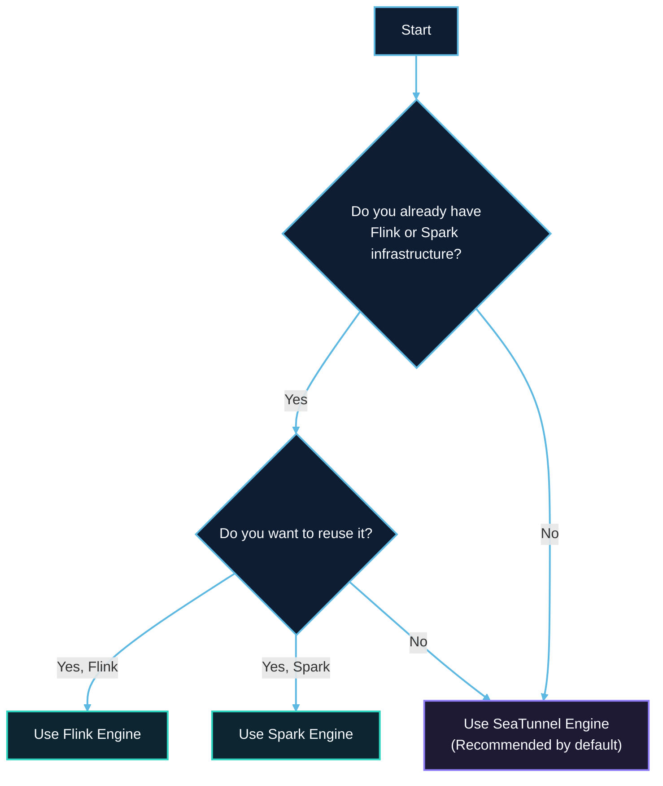

# Engine Overview

SeaTunnel supports multiple execution engines, allowing you to choose the best one for your use case. This document provides a comprehensive comparison to help you make the right choice.

## Start Here

If you are evaluating SeaTunnel for the first time, use this rule first and read the full comparison second:

- Start with **SeaTunnel Engine (Zeta)** if you do not already operate Flink or Spark infrastructure.
- Choose **Flink** if your team already runs Flink clusters and wants to reuse that operational stack.
- Choose **Spark** if your team already runs Spark and your workloads are mainly batch-oriented.

For most new deployments, SeaTunnel Engine is the recommended default because it has the shortest setup path, lower operational overhead, and strong support for synchronization workloads such as CDC and multi-table migration.

## Recommended Reading Path

- I want the shortest first-run path: [Getting Started Overview](../getting-started/overview.md) -> [SeaTunnel Engine](zeta/about.md) -> [Quick Start With SeaTunnel Engine](../getting-started/locally/quick-start-seatunnel-engine.md)
- I need detailed architecture context before choosing: [About SeaTunnel](../introduction/about.md) -> [How It Works](../introduction/how-it-works.md) -> [Architecture Overview](../architecture/overview.md)
- I already know my runtime platform: jump directly to [SeaTunnel Engine](zeta/about.md), [Flink Engine Guide](flink.md), or [Spark Engine Guide](spark.md)

## Supported Engines

| Engine | Description | Recommended For |
|--------|-------------|-----------------|
| **SeaTunnel Engine (Zeta)** | Native engine built specifically for data integration | New projects, data synchronization |
| **Apache Flink** | Distributed stream processing engine | Existing Flink infrastructure |
| **Apache Spark** | Distributed batch/stream processing engine | Existing Spark infrastructure |

## Quick Comparison

### Feature Comparison

| Feature | SeaTunnel Engine | Flink | Spark |
|---------|------------------|-------|-------|
| **Batch Processing** | ✅ | ✅ | ✅ |
| **Stream Processing** | ✅ | ✅ | ✅ |
| **CDC Support** | ✅ | ✅ | ❌ |
| **Exactly-Once** | ✅ | ✅ | ✅ |
| **Multi-Table Sync** | ✅ | ✅ | ✅ |
| **Schema Evolution** | ✅ | ✅ | ❌ |
| **REST API** | ✅ | ✅ | ❌ |
| **Web UI** | ✅ | ✅ | ✅ |
| **Standalone Mode** | ✅ | ✅ | ✅ |
| **Cluster Mode** | ✅ | ✅ | ✅ |

### Performance Comparison

| Metric | SeaTunnel Engine | Flink | Spark |
|--------|------------------|-------|-------|
| **Throughput** | ⭐⭐⭐ High | ⭐⭐ Medium | ⭐⭐ Medium |
| **Latency** | ⭐⭐⭐ Low | ⭐⭐⭐ Low | ⭐⭐ Medium |
| **Resource Usage** | ⭐⭐⭐ Low | ⭐⭐ Medium | ⭐ High |
| **Startup Time** | ⭐⭐⭐ Fast | ⭐⭐ Medium | ⭐ Slow |

### Ease of Use

| Aspect | SeaTunnel Engine | Flink | Spark |
|--------|------------------|-------|-------|
| **Installation** | ⭐⭐⭐ Simple | ⭐⭐ Medium | ⭐⭐ Medium |
| **Configuration** | ⭐⭐⭐ Simple | ⭐⭐ Medium | ⭐⭐ Medium |
| **Dependencies** | ⭐⭐⭐ None | ⭐⭐ Zookeeper (optional) | ⭐ YARN/Mesos |
| **Learning Curve** | ⭐⭐⭐ Easy | ⭐⭐ Medium | ⭐⭐ Medium |

## When to Use Each Engine

### SeaTunnel Engine (Zeta) - Recommended

**Best for:**
- New data integration projects
- Data synchronization and CDC scenarios
- Users without existing big data infrastructure
- Scenarios requiring low resource consumption
- Real-time synchronization of many small tables

**Advantages:**
- No external dependencies (no Zookeeper, HDFS required)
- Optimized for data synchronization scenarios
- Dynamic thread sharing for efficient resource usage
- Pipeline-level fault tolerance
- Built-in cluster management and HA
- JDBC connection multiplexing

**Example use cases:**
- MySQL to ClickHouse real-time sync
- Multi-table CDC synchronization
- Database migration projects

### Apache Flink

**Best for:**
- Organizations with existing Flink infrastructure
- Complex stream processing requirements
- Scenarios requiring Flink ecosystem integration

**Advantages:**
- Mature stream processing capabilities
- Rich ecosystem and community
- Advanced state management
- Integration with Flink SQL

**Example use cases:**
- Integration with existing Flink pipelines
- Complex event processing
- Scenarios requiring Flink-specific features

### Apache Spark

**Best for:**
- Organizations with existing Spark infrastructure
- Large-scale batch processing
- Integration with Spark ecosystem (MLlib, GraphX)

**Advantages:**
- Mature batch processing capabilities
- Rich ecosystem
- Integration with Hive, HDFS
- Support for YARN, Kubernetes

**Example use cases:**
- Large-scale ETL jobs
- Integration with existing Spark workflows
- Batch data warehouse loading

## Decision Flowchart



## Configuration Examples

### SeaTunnel Engine

```hocon
env {
  parallelism = 2
  job.mode = "STREAMING"
  checkpoint.interval = 10000
}
```

### Flink Engine

```hocon
env {
  parallelism = 2
  job.mode = "STREAMING"
  checkpoint.interval = 10000
  flink.execution.checkpointing.mode = "EXACTLY_ONCE"
  flink.execution.checkpointing.timeout = 600000
}
```

### Spark Engine

```hocon
env {
  parallelism = 2
  job.mode = "BATCH"
  spark.app.name = "SeaTunnel-Job"
  spark.executor.memory = "2g"
  spark.executor.instances = "2"
}
```

## Connector Compatibility

All SeaTunnel V2 connectors are compatible with all three engines. However, some features may have different behaviors:

| Connector Feature | SeaTunnel Engine | Flink | Spark |
|-------------------|------------------|-------|-------|
| CDC Connectors | ✅ Full support | ✅ Full support | ❌ Not supported |
| Exactly-once sink | ✅ Full support | ✅ Full support | ✅ Partial support |
| Multi-table read | ✅ Full support | ✅ Full support | ✅ Full support |

## Migration Guide

### From Flink to SeaTunnel Engine

1. Remove Flink-specific configurations (prefixed with `flink.`)
2. Keep common configurations (`parallelism`, `checkpoint.interval`)
3. Test with SeaTunnel Engine

### From Spark to SeaTunnel Engine

1. Remove Spark-specific configurations (prefixed with `spark.`)
2. Keep common configurations (`parallelism`, `job.mode`)
3. Test with SeaTunnel Engine

## Summary

| Scenario | Recommended Engine |
|----------|-------------------|
| New project without big data infrastructure | **SeaTunnel Engine** |
| CDC and real-time synchronization | **SeaTunnel Engine** |
| Existing Flink infrastructure | **Flink** |
| Existing Spark infrastructure | **Spark** |
| Low resource environment | **SeaTunnel Engine** |
| Complex stream processing | **Flink** |
| Large-scale batch ETL | **Spark** |

## Next Steps

- [SeaTunnel Engine Introduction](zeta/about.md)
- [Getting Started Overview](../getting-started/overview.md)
- [SeaTunnel Engine Quick Start](../getting-started/locally/quick-start-seatunnel-engine.md)
- [Flink Engine Guide](flink.md)
- [Spark Engine Guide](spark.md)
