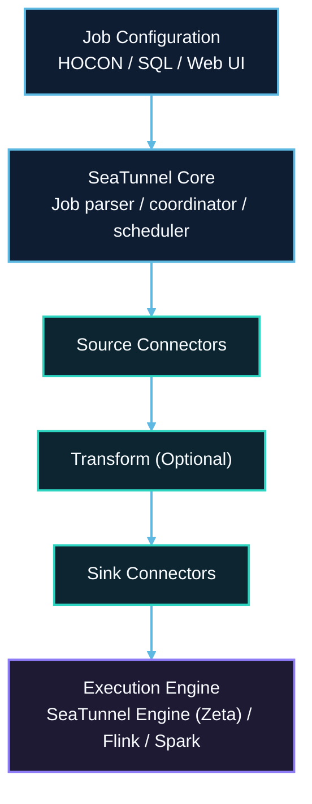
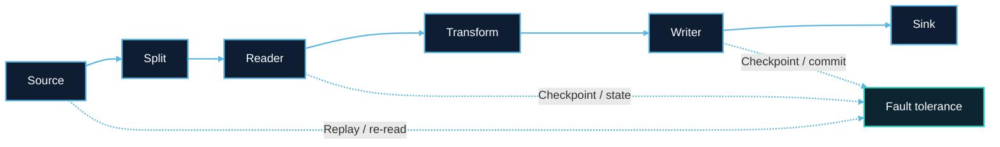

# How it works

## What New Users Should Know First

You do not need to understand every internal module before running SeaTunnel.
For most first-time users, the practical order is:

1. run one job locally
2. learn the config structure
3. choose the right connectors and engine
4. come back here when you want to understand the runtime model better

SeaTunnel is easiest to understand as a config-driven pipeline that runs on a chosen execution engine.

## Overview

SeaTunnel is a distributed multimodal data integration tool with a pluggable architecture. It decouples the connector layer from the execution engine, allowing the same connectors to run on different engines.

This page is the shortest bridge between first-run docs and deeper architecture docs. Read it when you already know SeaTunnel at a high level but still need a practical mental model of how job config, plugins, and engines connect.

## The Four Building Blocks

### 1. Job Configuration

Your config file describes what to read, how to transform it, where to write it, and which engine settings should be used.

### 2. SeaTunnel Core

SeaTunnel parses the config, builds an execution plan, loads plugins, and coordinates submission to the selected engine.

### 3. Source -> Transform -> Sink

This is the data path most users should remember first:

- **Source** reads from external systems
- **Transform** optionally reshapes or filters the data
- **Sink** writes the result to the target system

### 4. Execution Engine

The engine decides where the job runs. Most new users should start with [SeaTunnel Engine (Zeta)](../engines/zeta/about.md), then move to Flink or Spark only when their environment already depends on those platforms.

## Recommended Reading Path

If you are building your first system-level understanding, read in this order:

- [Getting Started Overview](../getting-started/overview.md) for the shortest first-run path
- this page for the execution model in one diagram
- [Engine Overview](../engines/overview.md) for engine selection
- [Architecture Overview](../architecture/overview.md) for the layered system view
- [Core API Design](../architecture/core-api-design.md) for the connector and metadata contracts
- [Transform Plugin System](../architecture/transform-plugin-system.md) if you need to understand dataset wiring and transform behavior

## Core Components

### 1. Connector API

Engine-independent API for developing Source, Transform, and Sink connectors.

| Component | Description |
|-----------|-------------|
| **Source** | Reads data from external systems (databases, files, message queues) |
| **Transform** | Performs data transformations (field mapping, filtering, type conversion) |
| **Sink** | Writes data to target systems |

### 2. Execution Engines

| Engine | Best For |
|--------|----------|
| **SeaTunnel Engine (Zeta)** | Data synchronization, CDC, low resource usage |
| **Apache Flink** | Complex stream processing, existing Flink infrastructure |
| **Apache Spark** | Large-scale batch processing, existing Spark infrastructure |

### 3. Translation Layer

Translates SeaTunnel's unified API to engine-specific implementations, enabling connector reuse across engines.

## Data Flow

**Key Features:**
- Parallel reading with split-based distribution
- Exactly-once semantics via distributed snapshots
- Automatic failover and recovery

## Module Structure

| Module | Responsibility |
|--------|----------------|
| `seatunnel-api` | Core API definitions |
| `seatunnel-connectors-v2` | Source and sink connectors |
| `seatunnel-transforms-v2` | Transform plugins |
| `seatunnel-engine` | SeaTunnel Engine (Zeta) |
| `seatunnel-translation` | Engine adapters for Flink and Spark |
| `seatunnel-core` | Job submission and CLI |
| `seatunnel-formats` | Data format handlers |
| `seatunnel-e2e` | End-to-end tests |

## Job Execution Flow

1. **Parse** - Read and validate job configuration
2. **Plan** - Generate execution plan with parallelism
3. **Schedule** - Distribute tasks to workers
4. **Execute** - Run Source → Transform → Sink pipeline
5. **Monitor** - Track progress, metrics, and checkpoints

## Next Steps

- [Engine Comparison](../engines/overview.md)
- [Getting Started Overview](../getting-started/overview.md)
- [Quick Start With SeaTunnel Engine](../getting-started/locally/quick-start-seatunnel-engine.md)
- [Architecture Overview](../architecture/overview.md)
- [Connector List](../connectors)
