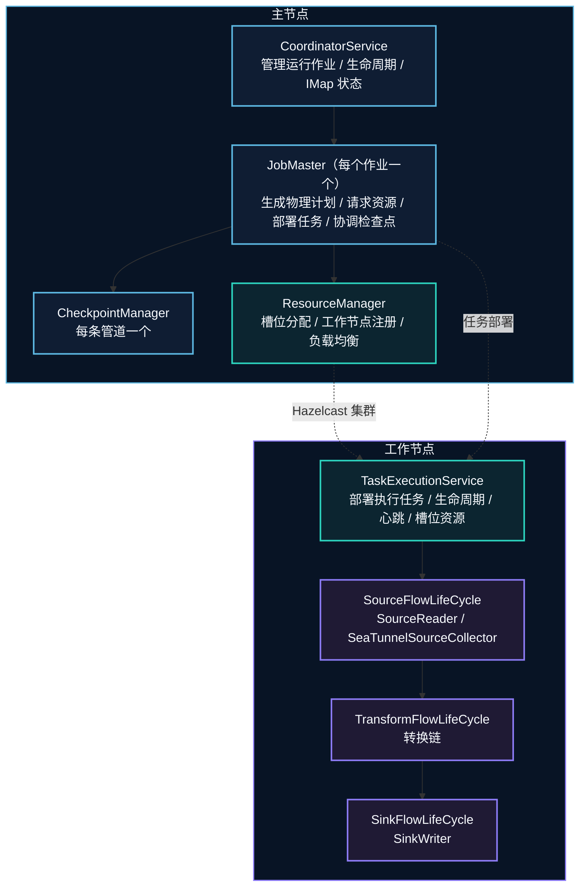
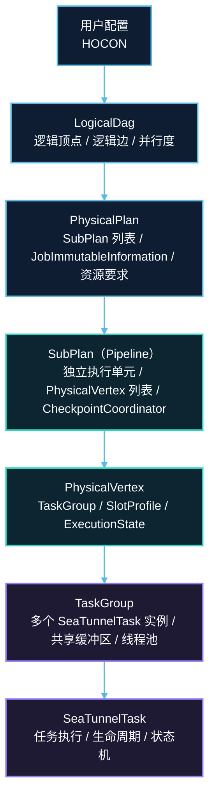
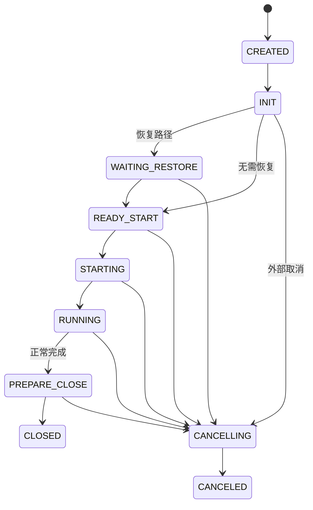
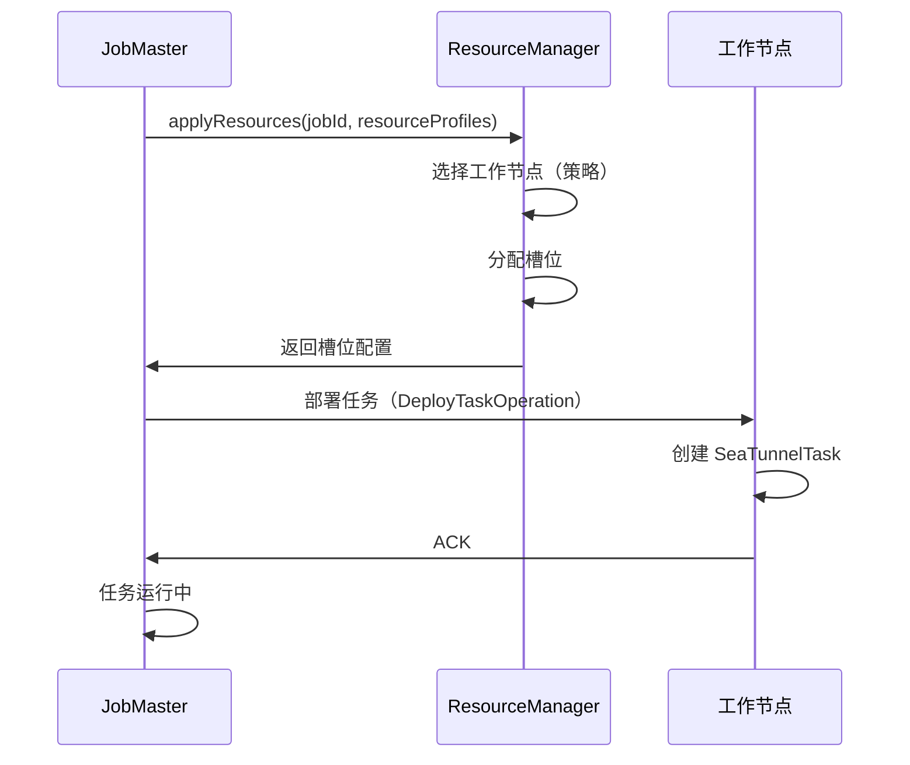

# SeaTunnel 引擎（Zeta）架构

## 1. 概述

### 1.1 问题背景

数据集成引擎必须解决基本的分布式系统挑战：

- **分布式执行**：如何跨多台机器执行作业？
- **资源管理**：如何高效地分配和调度任务？
- **容错**：如何从工作节点/主节点失败中恢复？
- **协调**：如何同步分布式任务（检查点、提交）？
- **可扩展性**：如何处理不断增加的工作负载？

### 1.2 设计目标

SeaTunnel 引擎（Zeta）设计为原生执行引擎，具有：

1. **轻量级**：最小依赖、快速启动、低资源开销
2. **高性能**：针对数据同步工作负载优化
3. **容错**：基于检查点的恢复与精确一次语义
4. **资源效率**：基于槽位的资源管理与细粒度控制
5. **引擎独立性**：支持与 Flink/Spark 转换相同的连接器 API

### 1.3 架构对比

| 特性 | SeaTunnel Zeta | Apache Flink | Apache Spark |
|---------|---------------|--------------|--------------|
| **主要用例** | 数据同步、CDC | 流处理 | 批处理 + ML |
| **资源模型** | 基于槽位 | 基于槽位 | 基于执行器 |
| **状态后端** | 可插拔（例如 localfile/hdfs 等，取决于配置与插件） | RocksDB/堆 | 内存/磁盘 |
| **检查点** | 分布式快照 | Chandy-Lamport | RDD 血统 |
| **启动时间** | 取决于部署与依赖 | 取决于部署与依赖 | 取决于部署与依赖 |
| **依赖** | 取决于打包与插件 | 取决于打包与插件 | 取决于打包与插件 |

## 2. 整体架构

### 2.1 主-工架构


```

### 2.2 核心组件

#### CoordinatorService

管理集群中所有作业的中心化服务。

**职责**：
- 接受作业提交
- 为每个作业创建 JobMaster
- 在分布式 IMap 中维护作业状态
- 提供作业查询和管理 API
- 处理作业生命周期事件

**关键数据结构**：

- 运行中作业元信息：作业基本信息、当前状态、状态变更时间戳（分布式存储，支持多节点一致读取）
- 已完成作业历史：用于查询与审计的作业快照（通常包含最终状态与关键元数据）

#### JobMaster

管理单个作业执行生命周期。

**职责**：
- 解析配置 → 生成 LogicalDag
- 从 LogicalDag 生成 PhysicalPlan
- 从 ResourceManager 请求资源（槽位）
- 将任务部署到工作节点
- 协调管道检查点
- 处理任务失败并重新调度

**生命周期**：
`Created → Initialized → Scheduled → Running → Finished / Failed / Canceled`

**关键操作**：
1. `init()`：生成物理计划，创建检查点协调器
2. `run()`：请求资源，部署任务，启动执行
3. `handleFailure()`：重启失败的任务，从检查点恢复

#### ResourceManager

管理工作节点资源和槽位分配。

**职责**：
- 跟踪工作节点注册和心跳
- 维护工作节点资源配置（CPU、内存）
- 基于策略分配槽位（随机、槽位比率、基于负载）
- 任务完成后释放槽位
- 处理工作节点失败

**槽位分配策略**：

- Random：在可用工作节点中随机选择
- SlotRatio：优先选择拥有更多可用槽位的工作节点
- SystemLoad：优先选择 CPU/内存使用率较低的工作节点

## 3. DAG 执行模型

### 3.1 执行计划转换



### 3.2 LogicalDag

以引擎独立的方式表示用户意图。

**核心元素（概念级）**：
- LogicalVertex：一个逻辑算子节点（Source / TransformChain / Sink），包含并行度等执行提示
- LogicalEdge：逻辑边，描述上游到下游的数据流向
- JobConfig：作业级配置（并行度、容错、资源、插件等）

**创建**：

由 `JobConfig`/用户配置构建：解析配置 → 生成顶点/边 → 生成可执行提示（并行度、资源等）。

### 3.3 PhysicalPlan

表示带资源分配的实际执行计划。

**核心结构（概念级）**：
- PhysicalPlan：由多个 `SubPlan`（管道）组成，并携带作业不可变元信息与终态结果句柄
- SubPlan（Pipeline）：一个独立执行单元，包含本管道的任务顶点集合，以及本管道的 checkpoint 协调器
- PhysicalVertex：一个可调度的并行实例，绑定到具体槽位/工作节点，并维护自身执行状态

**生成**：

由 JobMaster 完成：
1. 将 LogicalDag 切分为管道
2. 为每个顶点生成并行实例（PhysicalVertex）并计算资源需求
3. 为每个管道创建独立的 checkpoint 协调器

### 3.4 管道执行

作业被划分为**管道**（SubPlan）以便独立执行：

**示例**：
```hocon
# 多数据源/Sink 配置
env { ... }

source {
  MySQL-CDC { table = "orders" }
  Kafka { topic = "events" }
}

transform {
  Sql { query = "SELECT * FROM orders JOIN events ON ..." }
}

sink {
  Elasticsearch { index = "orders" }
  JDBC { table = "events" }
}
```

**生成的管道**：
```
管道 1: MySQL-CDC → 转换 → Elasticsearch
管道 2: Kafka → 转换 → JDBC
```

**好处**：
- 独立的检查点协调
- 隔离的失败域
- 并行管道执行

### 3.5 任务融合

多个操作可以融合到单个 TaskGroup 中以提高效率：

```
无融合：
[数据源任务] → 网络 → [转换任务] → 网络 → [数据 Sink 任务]

有融合：
[TaskGroup: 数据源 → 转换 → 数据 Sink ]（单线程，无网络）
```

**融合条件**：
- 相同的并行度
- 顺序依赖
- 不需要 shuffle

## 4. 任务生命周期

### 4.1 任务状态机



**状态转换**：
1. **CREATED → INIT**：任务已创建，并完成运行时资源初始化
2. **INIT → WAITING_RESTORE / READY_START**：根据是否需要恢复，进入恢复路径或直接启动路径
3. **WAITING_RESTORE → READY_START**：状态恢复完成，准备打开各生命周期组件
4. **READY_START → STARTING → RUNNING**：收到启动信号后进入正式处理阶段
5. **RUNNING → PREPARE_CLOSE → CLOSED**：正常完成并清理资源
6. **活动状态 → CANCELLING → CANCELED**：外部取消路径，与正常完成链路分开处理

**失败说明**：
- `FAILED` 是运行时对不可恢复错误的结果标记，但“失败后是否重启”由更高层的恢复逻辑决定，不应在这个任务状态机图里画成 `FAILED → ...` 的直接边。

### 4.2 SeaTunnelTask 执行

**执行骨架（语义级）**：
1. `init`：初始化运行时资源
2. `restoreState`：如果处于恢复路径，加载 checkpoint 状态
3. `open`：打开 Source/Transform/Sink 生命周期
4. 主循环：处理数据 + 处理 checkpoint 屏障/控制消息
5. `close`：正常结束时清理资源；异常时进入失败处理与上报

**任务类型**：
- **SourceSeaTunnelTask**：运行 SourceReader，发送数据
- **SinkSeaTunnelTask**：运行 SinkWriter，消费数据
- **TransformSeaTunnelTask**：运行转换链

### 4.3 FlowLifeCycle 管理

每个任务通过 FlowLifeCycle 管理组件生命周期：

**生命周期语义**：
- `open`：初始化 reader/transform chain/writer 等组件
- `collect`：数据驱动的执行入口（source poll、transform 处理、sink write）
- `close`：释放资源并保证幂等（可被重复调用）

## 5. 检查点协调

### 5.1 CheckpointCoordinator（每个管道）

每个管道都有独立的检查点协调器。

**职责**：
- 定期触发检查点
- 将检查点屏障注入数据流
- 收集任务确认
- 持久化完成的检查点
- 清理旧检查点

**关键数据结构**：

- checkpointId 生成器：单调递增生成 checkpointId
- pendingCheckpoints：进行中的 checkpoint 集合（等待 task ACK）
- completed checkpoints：最近成功的 checkpoint 列表（用于恢复与保留策略）
- checkpointStorage：外部持久化后端

**检查点流程**：
1. 协调器触发检查点（定期或手动）
2. 向管道中所有数据源任务发送屏障
3. 屏障通过数据流传播
4. 每个任务在收到屏障时快照状态
5. 任务向协调器发送 ACK
6. 协调器等待所有 ACK
7. 创建 CompletedCheckpoint，持久化到存储


### 5.2 检查点屏障

与数据一起流动的特殊控制消息：

**屏障字段（概念级）**：
- checkpointId：本次 checkpoint 的唯一标识
- timestamp：触发时间
- type：checkpoint/savepoint 等类型标识

**屏障对齐**：
- 具有多个输入的任务在快照前等待来自所有输入的屏障
- 确保分布式任务之间的一致性快照

## 6. 资源管理

### 6.1 槽位模型

**SlotProfile**：

- slotId：槽位标识
- worker：所属工作节点
- resourceProfile：CPU/内存等资源画像

**WorkerProfile**：

- address：工作节点地址
- total/available：总资源与可用资源
- assigned/unassigned：已分配与未分配槽位

### 6.2 资源分配流程



### 6.3 基于标签的槽位过滤

将任务分配到特定工作节点组：

```hocon
env {
  # 作业级 worker 标签过滤（key/value 全量匹配）
  tag_filter = {
    zone = "db-zone"
  }
}
```

**用途**：
- 数据局部性（分配到靠近数据源的工作节点）
- 资源隔离（ML 转换使用 GPU 工作节点）
- 多租户（不同团队使用不同的工作节点池）

说明：`tag_filter` 对整个作业/流水线生效；worker 的标签来源于集群成员属性（key/value），由集群部署侧配置与维护。

## 7. 失败处理

### 7.1 任务失败

**检测**：
- 任务向 JobMaster 报告异常
- JobMaster 监控任务心跳
- 超时触发失败检测

**恢复**：
1. 标记任务为 FAILED
2. 释放任务的槽位
3. 检索最新的成功检查点
4. 使用恢复的状态重启任务
5. 重新分配分片（对于数据源任务）

### 7.2 工作节点失败

**检测**：
- ResourceManager 监控工作节点心跳
- Hazelcast 集群检测成员移除

**恢复**：
1. 标记失败工作节点上的所有任务为 FAILED
2. 触发作业故障转移
3. 从最新检查点恢复
4. 在健康的工作节点上重新分配槽位
5. 重新部署任务

### 7.3 主节点失败

**高可用性**：
- 多个主节点（Hazelcast 集群）
- 作业状态存储在分布式 IMap 中（已复制）
- 新主节点从 IMap 状态接管

**恢复**：
1. 检测主节点失败（Hazelcast）
2. 选举新主节点
3. 新主节点从 IMap 读取作业状态
4. 重新连接到工作节点
5. 恢复检查点协调

## 8. 设计考量

### 8.1 为什么基于管道的执行？

**替代方案**：单一全局 DAG 执行

**决策**：划分为管道

**好处**：
- 独立的检查点协调（较少的协调开销）
- 清晰的失败边界（一个管道失败，其他继续）
- 更容易推理数据流
- 支持复杂的 DAG（多数据源/Sink ）

**缺点**：
- 无法跨管道边界融合任务
- 管道之间潜在的数据序列化

### 8.2 为什么使用 Hazelcast 进行协调？

**替代方案**：Zookeeper、etcd、自定义 Raft 实现

**决策**：Hazelcast IMDG

**好处**：
- 内存分布式数据结构（低延迟）
- 内置集群管理和失败检测
- 易于嵌入（无外部依赖）
- 熟悉的 API（Java Collections）

**缺点**：
- 大状态的内存开销
- 作为协调工具，不如 Zookeeper 经过充分测试

### 8.3 性能优化

**1. 任务融合**：
- 减少网络开销
- 改善 CPU 缓存局部性
- 降低序列化成本

**2. 异步检查点**：
- 检查点上传不阻塞数据处理
- 跨任务并行检查点

**3. 增量检查点**：
- 仅上传更改的状态（未来增强）

**4. 零拷贝数据传输**：
- 共存任务之间的共享内存
- 避免不必要的序列化

## 9. 相关资源

- [架构概览](../overview.md)
- [设计理念](../design-philosophy.md)
- [检查点机制](../fault-tolerance/checkpoint-mechanism.md)
- [资源管理](resource-management.md)
- [DAG 执行](dag-execution.md)

## 10. 参考资料
### 进一步阅读

- [Hazelcast IMDG](https://docs.hazelcast.com/imdg/latest/)
- [Google Borg 论文](https://research.google/pubs/pub43438/) - 资源管理的灵感来源
- [Apache Flink 架构](https://flink.apache.org/flink-architecture.html)
