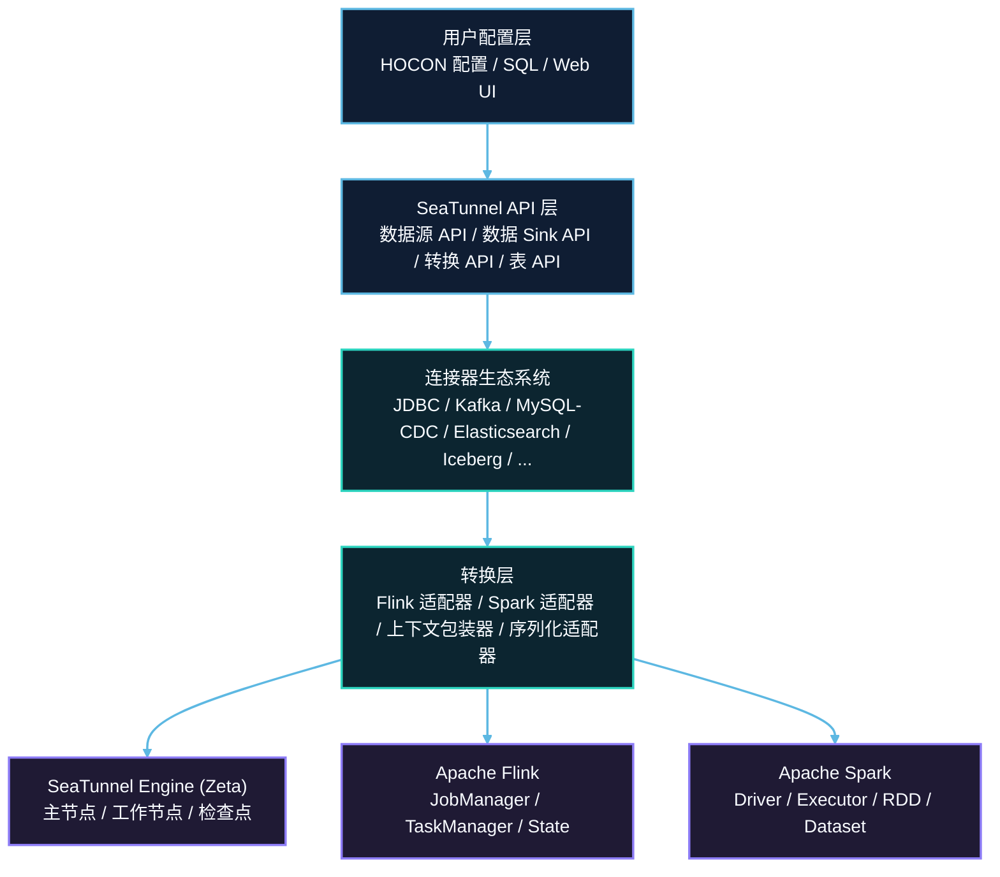
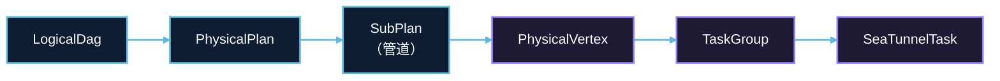
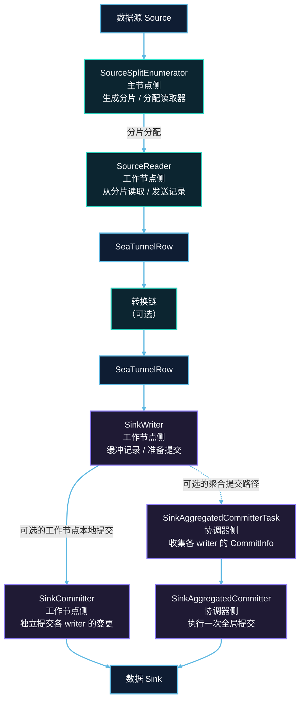
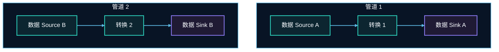
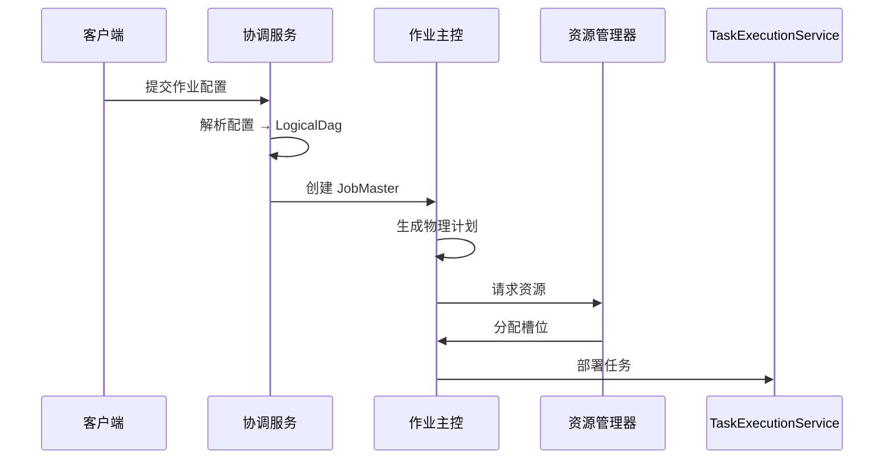
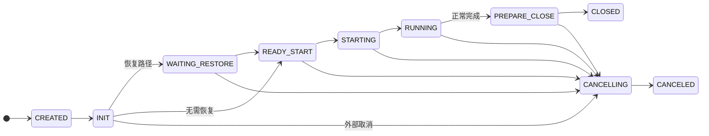
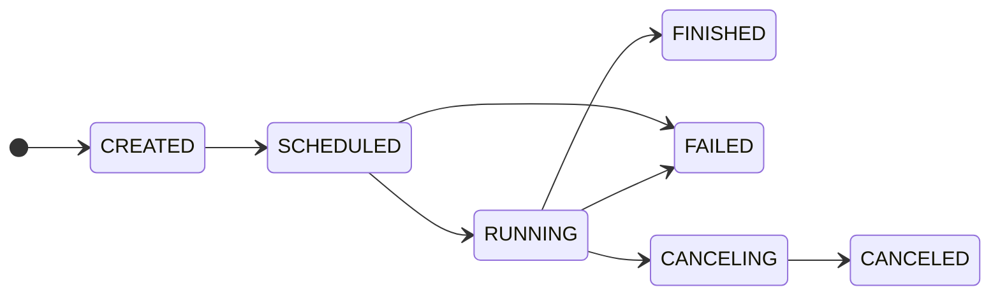

# SeaTunnel 架构概览

## 1. 简介

### 1.1 设计目标

SeaTunnel 设计为分布式多模态数据集成工具，具有以下核心目标：

- **引擎独立性**：将连接器逻辑尽量与执行引擎解耦；连接器可通过转换层适配到不同引擎，具体可用性以连接器能力与引擎支持为准
- **超高性能**：支持高吞吐、低延迟的大规模数据同步
- **容错性**：在启用 checkpoint 且外部系统支持事务/幂等提交等前提下，通过分布式快照与提交协议提供可验证的一致性语义
- **易用性**：提供简单的配置方式和丰富的连接器生态系统
- **可扩展性**：基于插件的架构，便于添加新的连接器和转换组件

### 1.2 目标场景

- **批量数据同步**：异构数据源之间的大规模批量数据迁移
- **实时数据集成**：支持 CDC 的流式数据捕获和同步
- **数据湖/仓入库**：高效加载数据到数据湖（Iceberg、Hudi、Delta Lake）和数据仓库
- **多表同步**：在单个作业中同步多个表，支持模式演化

### 1.3 推荐阅读路径

如果你希望通过架构章节建立整体认知，建议按下面顺序阅读：

- 先阅读本页，建立分层视图
- 再看 [配置与 Option 系统](./configuration-and-option-system.md)，理解插件配置是如何定义、校验和暴露的
- 再看 [Transform 插件体系](./transform-plugin-system.md)，理解 transform 如何位于 source、sink、schema 与引擎适配之间
- 再看 [表模型与类型系统](./table-schema-and-type-system.md)，理解表元数据和可移植类型如何贯穿整条链路
- 如果你关注 CDC 链路，再看 [CDC Pipeline 架构概览](./cdc-pipeline-architecture.md)
- 再看 [Checkpoint 机制](./fault-tolerance/checkpoint-mechanism.md) 和 [Exactly-Once](./fault-tolerance/exactly-once.md)，理解一致性语义
- 再看 [资源管理](./engine/resource-management.md)，理解 slot 分配与 worker 协调
- 再看 [插件发现与类加载](./plugin-discovery-and-class-loading.md)，理解插件打包、发现与依赖隔离
- 如果要理解多引擎适配，再看 [转换层](./api-design/translation-layer.md)

## 2. 整体架构

SeaTunnel 采用分层架构，实现关注点分离和灵活性：

### 2.1 层级职责

| 层级 | 职责 | 核心组件 |
|-----|------|---------|
| **配置层** | 作业定义、参数配置 | HOCON 解析器、SQL 解析器、配置验证 |
| **API 层** | 连接器的统一抽象 | 数据源/数据 Sink /转换接口、CatalogTable |
| **连接器层** | 数据源/Sink 实现 | 连接器实现（JDBC、Kafka、CDC 等） |
| **转换层** | 引擎特定适配 | Flink/Spark 适配器、上下文包装器 |
| **引擎层** | 作业执行和资源管理 | 调度、容错、状态管理 |

## 3. 核心组件

### 3.1 SeaTunnel API

API 层提供引擎独立的抽象：

#### 数据源 Source API
- **SeaTunnelSource**：创建读取器和枚举器的工厂接口
- **SourceSplitEnumerator**：主节点侧组件，负责分片生成和分配
- **SourceReader**：工作节点侧组件，负责从分片读取数据
- **SourceSplit**：表示数据分区的最小可序列化单元

**关键设计**：协调（枚举器）与执行（读取器）分离，实现高效的并行处理和容错。

#### 数据 Sink  API
- **SeaTunnelSink**：创建写入器和可选提交策略的工厂接口
- **SinkWriter**：工作节点侧组件，负责写入数据
- **SinkCommitter**：工作节点侧的可选提交器，负责独立提交单个 writer 的变更
- **SinkAggregatedCommitter**：协调端聚合提交路径上的可选全局提交器

**关键设计**：两阶段提交协议（prepareCommit → commit）在外部系统支持事务/幂等提交且启用 checkpoint 的前提下，可提供一致性语义。

#### 转换 API
- **SeaTunnelTransform**：数据转换接口
- **SeaTunnelMapTransform**：1:1 转换
- **SeaTunnelFlatMapTransform**：1:N 转换

#### 表 API
- **CatalogTable**：完整的表元数据（模式、分区键、选项）
- **TableSchema**：模式定义（列、主键、约束）
- **SchemaChangeEvent**：表示模式演化的 DDL 变更

### 3.2 SeaTunnel Engine (Zeta)

原生执行引擎提供：

#### 主节点组件
- **CoordinatorService**：管理所有运行中的 JobMaster
- **JobMaster**：管理单个作业生命周期、生成物理计划、协调检查点
- **CheckpointCoordinator**：每个管道协调分布式快照
- **ResourceManager**：管理工作节点资源和槽位分配

#### 工作节点组件
- **TaskExecutionService**：部署和执行任务
- **SeaTunnelTask**：执行数据源 Source/转换/数据 Sink 逻辑
- **FlowLifeCycle**：管理数据源 Source/转换/数据 Sink 组件的生命周期

#### 执行模型

### 3.3 转换层

通过适配器模式实现引擎可移植性：

- **FlinkSource/FlinkSink**：将 SeaTunnel API 适配到 Flink 的数据源/Sink 接口
- **SparkSource/SparkSink**：将 SeaTunnel API 适配到 Spark 的 RDD/Dataset 接口
- **上下文适配器**：包装引擎特定的上下文（SourceReaderContext、SinkWriterContext）
- **序列化适配器**：桥接 SeaTunnel 和引擎序列化机制

### 3.4 连接器生态系统

所有连接器遵循标准化结构：

| 区域 | 典型文件 | 职责 |
|------|----------|------|
| Source 入口 | `[Name]Source.java`、`[Name]SourceReader.java`、`[Name]SourceSplitEnumerator.java`、`[Name]SourceSplit.java` | 读取数据、切分任务并暴露统一的 Source 契约 |
| Sink 入口 | `[Name]Sink.java`、`[Name]SinkWriter.java` | 缓冲、写入并向目标系统提交数据 |
| 配置定义 | `config/[Name]Config.java` | 定义连接器参数、校验规则和默认值 |
| SPI 注册 | `META-INF/services/TableSourceFactory`、`META-INF/services/TableSinkFactory` | 注册工厂，供运行时发现和装载 |

**发现机制**：Java SPI（服务提供者接口）用于动态连接器加载。

## 4. 数据流模型

### 4.1 数据读取 Source 端数据流

### 4.2 基于分片的并行度

- 数据源被划分为**分片**（如文件块、数据库分区、Kafka 分区）
- 每个 **SourceReader** 独立处理一个或多个分片
- 动态分片分配实现负载均衡和故障恢复
- 分片状态被检查点化以实现精确一次处理

### 4.3 管道执行

作业被划分为**管道**（SubPlan）：

下图表示同一个作业中的两个独立子计划，它们之间不存在直接的数据记录流转。

每个管道：
- 具有独立的并行度配置
- 维护自己的检查点协调器
- 可以并发或顺序执行

## 5. 作业执行流程

### 5.1 提交阶段

### 5.2 执行阶段

1. **任务初始化**
   - 将任务部署到分配的槽位
   - 初始化数据 Source/转换/数据 Sink 组件
   - 从检查点恢复状态（如果在恢复中）

2. **数据处理**
   - SourceReader 从分片拉取数据
   - 数据流经转换链
   - SinkWriter 缓冲和写入数据

3. **检查点协调**
   - CheckpointCoordinator 触发检查点
   - 检查点屏障流经数据管道
   - 任务快照其状态
   - 协调器收集确认

4. **提交阶段**
   - SinkWriter 准备提交信息
   - 默认由工作节点侧 `SinkCommitter` 独立提交各 writer 的变更；如果启用聚合提交，则改由协调端执行一次全局提交
   - 状态持久化到检查点存储

### 5.3 状态机

**任务状态转换**：

**失败说明**：
- `FAILED` 是运行时对不可恢复错误的结果标记，但“失败后是否重启”由更高层的恢复逻辑决定，不应在这个任务状态机图里画成 `FAILED → ...` 的直接边。

**作业状态转换**：

## 6. 关键特性

### 6.1 容错

**检查点机制**：
- 受 Chandy-Lamport 算法启发的分布式快照
- 检查点屏障在数据流中传播
- 状态存储在可插拔的检查点存储中（HDFS、S3、本地）
- 从最新成功的检查点自动恢复

**故障转移策略**：
- 任务级故障转移：重启失败的任务和相关管道
- 基于区域的故障转移：最小化对未受影响任务的影响
- 分片重新分配：失败的分片重新分配给健康的工作节点

### 6.2 精确一次语义

**两阶段提交协议**：
1. **准备阶段**：SinkWriter 在检查点期间准备提交信息
2. **提交阶段**：默认由工作节点侧 `SinkCommitter` 独立提交各 writer 的变更；如果启用聚合提交，则在 checkpoint 成功后由协调端执行一次全局提交
3. **中止处理**：在提交前失败时回滚

**幂等性**：`SinkCommitter` 与 `SinkAggregatedCommitter` 的提交操作都必须保持幂等，以便在重试场景下不重复生效

### 6.3 动态资源管理

- **基于槽位的分配**：细粒度的资源管理
- **基于标签的过滤**：将任务分配到特定的工作节点组
- **负载均衡**：多种策略（随机、槽位比率、系统负载）
- **动态扩缩容**：无需重启作业即可添加/移除工作节点（未来特性）

### 6.4 模式演化

- **DDL 传播**：从数据源捕获模式变更（ADD/DROP/MODIFY 列）
- **模式映射**：通过管道转换模式变更
- **动态应用**：将模式变更应用到数据 Sink 表
- **兼容性检查**：在应用前验证模式变更

### 6.5 多表支持

- **单作业多表**：在一个作业中同步数百个表
- **表路由**：根据 TablePath 将记录路由到正确的数据 Sink 
- **独立模式**：每个表维护自己的模式
- **副本支持**：每个表多个写入器副本以获得更高吞吐量

## 7. 模块结构

| 模块 | 代表子目录 | 职责 |
|------|------------|------|
| `seatunnel-api` | `source`、`sink`、`transform`、`table` | 定义核心 API、表模型与跨引擎抽象 |
| `seatunnel-connectors-v2` | `connector-jdbc`、`connector-kafka`、`connector-cdc-mysql` | 提供各类数据源与目标端连接器实现 |
| `seatunnel-transforms-v2` | `src`（SQL、Filter 等） | 提供通用转换能力 |
| `seatunnel-engine` | `seatunnel-engine-core`、`seatunnel-engine-server`、`seatunnel-engine-storage` | 承载 Zeta 执行、调度和检查点存储 |
| `seatunnel-translation` | `seatunnel-translation-flink`、`seatunnel-translation-spark` | 负责多引擎适配层 |
| `seatunnel-formats` | `seatunnel-format-json`、`seatunnel-format-avro` | 处理不同数据格式 |
| `seatunnel-core` | CLI 与提交入口 | 负责作业提交和命令行能力 |
| `seatunnel-e2e` | 端到端测试套件 | 保障关键链路回归 |

## 8. 设计原则

### 8.1 关注点分离

- **API vs 实现**：清晰的 API 边界支持多种实现
- **协调 vs 执行**：枚举器与聚合提交编排负责协调，读取器与写入器负责工作节点上的实际执行
- **逻辑 vs 物理**：LogicalDag（用户意图）与 PhysicalPlan（执行细节）分离

### 8.2 插件架构

- **基于 SPI 的发现**：连接器通过 Java SPI 动态加载
- **类加载器隔离**：每个连接器使用隔离的类加载器
- **热插拔**：无需重新构建核心即可添加连接器

### 8.3 引擎独立性

- **统一 API**：相同的连接器代码在任何引擎上运行
- **转换层**：将 API 适配到引擎特定细节
- **无引擎泄漏**：连接器开发人员无需了解引擎知识

### 8.4 可扩展性

- **水平扩展**：添加工作节点以提高吞吐量
- **基于分片的并行度**：细粒度并行处理
- **无状态工作节点**：工作节点可以动态添加/移除

### 8.5 可靠性

- **分布式检查点**：跨分布式任务的一致性快照
- **增量状态**：优化大状态的检查点大小
- **精确一次保证**：端到端一致性

## 9. 下一步

深入了解特定架构组件：

- [设计理念](design-philosophy.md) - 核心设计原则和权衡
- [Transform 插件体系](transform-plugin-system.md) - 理解 transform 插件如何组织、发现，并承担行数据与 schema 改写职责
- [表模型与类型系统](table-schema-and-type-system.md) - 理解 schema、元数据和可移植类型如何在 connector 与引擎之间流动
- [CDC Pipeline 架构概览](cdc-pipeline-architecture.md) - 理解快照、增量变更捕获与 sink 落地如何协同
- [数据 Source 架构](api-design/source-architecture.md) - 数据源 API 设计深入探讨
- [数据 Sink 架构](api-design/sink-architecture.md) - 数据 Sink  API 设计深入探讨
- [插件发现与类加载](plugin-discovery-and-class-loading.md) - 理解 factory、jar 与依赖隔离在运行时如何被解析
- [引擎架构](engine/engine-architecture.md) - SeaTunnel Engine 内部机制
- [检查点机制](fault-tolerance/checkpoint-mechanism.md) - 容错实现

实践指南：

- [如何创建您的连接器](../developer/how-to-create-your-connector.md)
- [快速入门](../getting-started/locally/quick-start-seatunnel-engine.md)

## 10. 参考资料

### 10.1 相关概念

- [Apache Flink](https://flink.apache.org/) - 检查点和状态管理的灵感来源
- [Apache Kafka](https://kafka.apache.org/) - 消费者组模型影响了分片分配
- [Chandy-Lamport 算法](https://en.wikipedia.org/wiki/Chandy-Lamport_algorithm) - 分布式快照算法
