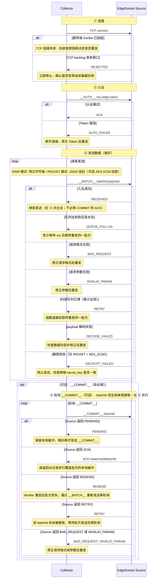

import ChangeLog from '../changelog/connector-edge-socket.md';

# EdgeSocket

> 流式 Source 连接器，接收轻量边缘采集器通过 Socket 主动推送的数据。

## 支持引擎

> SeaTunnel Zeta

## 主要特性

- [ ] [batch](../../introduction/concepts/connector-v2-features.md)
- [x] [stream](../../introduction/concepts/connector-v2-features.md)
- [ ] [exactly-once](../../introduction/concepts/connector-v2-features.md)
- [ ] [column projection](../../introduction/concepts/connector-v2-features.md)
- [ ] [parallelism](../../introduction/concepts/connector-v2-features.md)
- [ ] [support user-defined split](../../introduction/concepts/connector-v2-features.md)

## 描述

EdgeSocket 在 Zeta Worker 内监听一个 TCP 端口，等待边缘采集器主动连接并推送数据，Source 将收到的批次数据入队后交给下游处理。由于 Source 需要绑定固定 TCP 端口，并行度必须设置为 1。若并行度大于 1，多个 reader 会同时尝试绑定同一端口，只有一个能成功，其余均会报错。

采用推送模型：由采集器主动连入 Source，Source 不会回拨采集器。因此网络要求是采集器能访问 Worker 的 TCP 端口。

:::caution 单采集器限制

每个 EdgeSocket source reader 同时仅接受一个采集器连接。
连接建立、REJECTED 返回和重试建议见下文“采集器协议”。

如需同时采集多个数据源，请为每个采集器创建独立的作业（Job）。

:::

## 参数说明

| 参数名                  | 类型     | 必填 |  默认值 |  描述 |
|------------------------|---------|------|--------|------|
| port                   | Integer | 是   | -      | Source 在 Zeta Worker 上监听的 TCP 端口。 |
| token                  | String  | 是   | -      | 采集器认证 Token。采集器连接后第一行必须发送 `__AUTH__:<token>`，才能进入数据发送阶段。 |
| auth_type              | String  | 否   | TOKEN  | 认证方式。当前版本只支持 TOKEN。 |
| packet_mode            | String  | 否   | RAW    | 数据帧格式。RAW：每行为纯文本 payload；PACKET：每行为 JSON 包（见[包协议](#包协议)）。 |
| secret_key             | String  | 否   | -      | Base64 编码的 AES-256 密钥（32 字节）。仅当 packet_mode = PACKET 且 encryption = AES_GCM 时需要。两端配置相同的值。 |
| local_queue_capacity   | Integer | 否   | 1024   | 本地内存队列最大条数。必须大于 0。详见[调优指南](#调优指南)。 |
| queue_backpressure_watermark_ratio | Double | 否 | 0.9 | local_queue_capacity 的高水位比例。当队列长度达到 ceil(capacity × ratio) 时，Source 在不解码 payload 的情况下回复 QUEUE_FULL。取值须在 (0, 1]。 |
| queue_full_retry_after_ms | Integer | 否 | 500 | QUEUE_FULL 响应中的退避毫秒数（格式 QUEUE_FULL:ms）。必须大于 0。 |
| max_retries            | Integer | 否   | 3      | 端口绑定失败时的最大重试次数。耗尽后 Source 停止并抛出错误。设为 -1 表示无限重试。 |
| reconnect_interval_ms  | Integer | 否   | 1000   | 每次端口绑定重试之间的等待时间（毫秒），用于控制 Source 侧 bind 失败后的重试间隔，而非采集器重连间隔。 |
| accept_timeout_ms      | Integer | 否   | 1000   | Socket accept/read 超时时间（毫秒）。Source 超时后会继续循环检查自身状态，不会因此退出。 |
| endpoint               | String  | 否   | -      | Source 对外可达的入口地址，格式 host:port（例如 K8s LoadBalancer DNS、VPC EIP 或 NAT 地址）。此字段不改变本地绑定地址（始终为 0.0.0.0:port），仅用于观测。 |
| schema                 | Config  | 否   | -      | 输出 schema 定义。未配置时输出单个 STRING 字段（字段名 value）；配置后将 payload 解析为 JSON 并映射到声明的字段。详见 [Schema 模式](#schema-模式)。 |
| common-options         | -       | 否   | -      | Source 通用参数，详见 [Source Common Options](../common-options/source-common-options.md)。 |

## 快速开始

### 最小配置

```hocon
source {
  EdgeSocket {
    port = 9999
    token = "my-edge-token"
  }
}
```

### 完整示例（含下游 Sink）

```hocon
env {
  parallelism = 1
  job.mode = "STREAMING"
}

source {
  EdgeSocket {
    port = 9999
    token = "my-edge-token"
    local_queue_capacity = 2048
  }
}

sink {
  Kafka {
    topic = "edge-events"
    bootstrap.servers = "kafka:9092"
  }
}
```

## Schema 模式

默认输出单个 STRING 字段（字段名 value），内容为 payload 原始文本。

如需将 JSON payload 解析为结构化字段，可声明 schema：

```hocon
source {
  EdgeSocket {
    port = 9999
    token = "my-edge-token"
    schema {
      fields {
        user_id = "int"
        event   = "string"
        ts      = "long"
      }
    }
  }
}
```

入站 payload 必须是符合 schema 声明的合法 JSON；字段不匹配或解析失败时，Job 会抛出异常并快速失败（fail-fast）。Source 不会静默丢弃非法记录。

## 网络配置

Source 被动监听，采集器需要能访问 Worker 所在节点的 TCP 端口。

:::tip Source Task 漂移与地址稳定性
EdgeSocket 绑定实际运行 Worker 的本地端口。Job 重启后，如果 Source Task 漂移到其他 Worker，采集器原目标地址立即失效。

部署要求如下：

- K8s：使用 LoadBalancer Service（推荐），见下方 [K8s 部署](#k8s-部署)。
- VM / 裸机：使用 Zeta tag_filter 将 Source 固定到指定 Worker。

:::

<details>
<summary>VM / 裸机：通过 tag_filter 固定 Source</summary>

第 1 步 — 在目标 Worker 的 hazelcast.yaml 中打标签：

```yaml
hazelcast:
  member-attributes:
    edge-ingress:
      type: string
      value: "true"
```

第 2 步 — 在 Job 配置中设置 tag_filter，使 Source 始终调度到该节点：

```hocon
env {
  job.mode = "STREAMING"
  tag_filter {
    edge-ingress = "true"
  }
}

source {
  EdgeSocket {
    port = 10091
    token = "edge-token"
    endpoint = "192.168.1.10:10091"
  }
}
```

调度器仅在 member-attributes 与 tag_filter 全量匹配的 Worker 上分配 Slot。

</details>

### 常见部署场景

| 部署场景 | 是否默认可达 | 推荐程度 | 建议做法 |
|---|---|---|---|
| 采集器与 Worker 在同一 VPC / 内网 | 是 | - | 采集器直接连接 worker-ip:port。 |
| 采集器与 Worker 跨 VPC（路由已打通） | 是 | - | 采集器连接 Worker IP；可配置 endpoint。 |
| Worker 绑定了 VPC EIP 或 NAT | 是（通过公网地址） | - | 采集器连接 EIP/NAT 地址；设置 endpoint = eip:port，便于日志观测。 |
| Worker 在 K8s 并通过 LoadBalancer 暴露 | 是（通过 LB 地址） | 推荐 | 采集器连接 LB DNS 或 IP；设置 endpoint = lb-dns:port。 |
| Worker 在 K8s 通过污点 + tag 固定节点 | 是（通过节点 IP） | 不推荐 | 通过 taint/nodeSelector + SeaTunnel tag_filter 固定 Pod；节点故障会导致 Job 不可用。 |
| Worker 所在网络完全没有入口 | 否 | - | 先通过 EIP / LB / NAT / 反向隧道建设可达入口，再配置采集器连接该入口。 |

### K8s 部署

Kubernetes 环境下暴露 EdgeSocket 端口有两种主要方式：

#### 方式一：LoadBalancer / ELB（推荐）

创建 LoadBalancer 类型的 Service 指向 Zeta Worker Pod。采集器连接外部 LB 地址，流量自动路由到正确的 Pod。

推荐理由：
- 采集器目标地址稳定，不受 Pod 重新调度影响。
- 无需通过节点亲和性或污点限制调度。
- 天然适配托管 Kubernetes（EKS、GKE、AKS 等）。

```hocon
source {
  EdgeSocket {
    port = 10091
    token = "edge-token"
    local_queue_capacity = 2048
    endpoint = "edge-lb.prod.example.com:10091"
  }
}
```

#### 方式二：节点污点 + SeaTunnel tag（不推荐）

通过 Kubernetes 节点污点（taint）/ nodeSelector 将 Zeta Worker Pod 固定到指定节点，配合 SeaTunnel 的 tag_filter 确保 Source Task 始终落在该 Worker 上。采集器直接连接节点 IP。

:::warning

不推荐在生产环境使用此方式，原因：
- Job 绑定到特定物理节点，节点宕机后无法自动故障转移。
- 限制调度灵活性，浪费集群资源。
- 需要为每个节点手动管理防火墙规则。

仅在无法使用 LoadBalancer 的场景（如无 MetalLB 的自建裸机 K8s）下考虑此方式。

:::

```hocon
env {
  job.mode = "STREAMING"
  tag_filter {
    edge-ingress = "true"
  }
}

source {
  EdgeSocket {
    port = 10091
    token = "edge-token"
    endpoint = "192.168.1.50:10091"
  }
}
```

### VM / 裸机示例

```hocon
source {
  EdgeSocket {
    port = 10091
    token = "edge-token"
    # 采集器直接连接该 Worker 的内网 IP，无需配置 endpoint
  }
}
```

## 采集器协议

采集器通过普通 TCP 连接 Source，使用基于行的文本协议。

### 连接

Source 同一时刻仅接受一个采集器连接，通过两层机制保证：

1. 一旦采集器会话建立，服务端 Socket 会被挂起（关闭）。后续连接尝试在 TCP 层直接失败（Connection refused）。
2. 在极少数竞争窗口内——如果第二个采集器在第一个被接受时已经在 TCP backlog 中等待——Source 在应用层回复 REJECTED。

当前活跃采集器断开后，服务端 Socket 会自动重新打开，新采集器可正常连接。

### 认证

TCP 连接成功后，第一行必须发送：

```
__AUTH__:<token>
```

Source 回复：

- ACK — 认证通过，开始发送数据。
- AUTH_FAILED — Token 错误，采集器必须使用正确 Token 重新连接。

### 发送批次

认证通过后，每次发送一个批次：

```
__BATCH__:<batchId>:<payload>
```

Source 回复：

- RECEIVED — 批次已接收并入队。
- `QUEUE_FULL:<ms>` — 队列达到背压高水位；至少等待 `<ms>` 毫秒（来自 queue_full_retry_after_ms）后原样重发同一批次。此情况下 Source 不会解码 payload。
- BAD_REQUEST — 请求格式无效（无法识别的命令前缀、缺少 payload 分隔符等）。采集器应修正请求格式后重发。
- INVALID_PARAM — 请求参数无效（例如 batchId 为非正整数）。采集器应修正参数后重发。
- RETRY — 内部队列已满（高水位竞态窗口下极少出现）。采集器应执行指数退避后重发同一批次。
- DECODE_FAILED — payload 解码失败（例如解压缩数据损坏或 PACKET 模式下 JSON 格式无效）。采集器应检查数据内容后修正重发。
- DECRYPT_FAILED — 解密失败。采集器应停止发送并检查两端 secret_key 配置是否一致。

### 背压

当本地队列长度达到 ceil(local_queue_capacity × queue_backpressure_watermark_ratio)（默认 90%）时，Source 在应用层回复 `QUEUE_FULL:<ms>`，且不会解码 payload。`<ms>` 来自 queue_full_retry_after_ms（默认 500）。

QUEUE_FULL 与 RETRY 的区别：QUEUE_FULL 是下游消费速度不足的背压信号，在高水位阈值处触发；RETRY 仅在队列物理容量耗尽时返回（高水位竞态窗口下极少出现）。BAD_REQUEST / INVALID_PARAM 针对协议格式或参数错误；DECODE_FAILED / DECRYPT_FAILED 表示 payload 内容无法正确处理。

### 轮询 checkpoint 确认

RECEIVED 仅表示批次已入队，不表示作业 checkpoint 已完成；在下一次 checkpoint 完成前若 Worker 重启，内存队列中的数据会丢失。`__COMMIT__` 为可选，采集端可仅使用 `__BATCH__` → RECEIVED。若启用 `__COMMIT__`，在收到 `ACK:<watermark>` 前保留本地缓冲，并按 Source 返回水位清理缓冲。

**batchId 必须全局单调递增**，贯穿逻辑 Source 的整个生命周期，包括断线重连和 Worker 重启。重新连接后，采集器必须从上次收到的 `ACK:<watermark>` 水位之后的值继续递增，不能重置为 1。Source 依据已提交的水位作为 ACK 边界，单调性是该机制正确工作的前提。

```
__COMMIT__:<batchId>
```

Source 回复：

- PENDING — 批次已接收，尚未完成 checkpoint 确认。保留缓冲，稍后继续轮询。
- `ACK:<watermarkBatchId>` — 小于等于 watermarkBatchId 的批次均已 checkpoint 确认，可安全丢弃这些批次的本地缓冲。
- RESEND — 该 batchId 处于上一会话已接收的批次 ID 范围内，但在当前会话状态中不存在（例如 Worker 重启后批次已从内存队列丢失）。需先通过 `__BATCH__:<batchId>:<payload>` 重新发送，再继续轮询 `__COMMIT__`。
- RETRY — 该 batchId 尚未通过 `__BATCH__` 被 Source 接收。等待批次发送完成后再轮询 `__COMMIT__`。
- BAD_REQUEST — 请求格式无效。采集器应修正请求格式后重发。
- INVALID_PARAM — batchId 无效（非正整数）。采集器应修正参数后重发。

含可选 `__COMMIT__` 的发送示例：

```
→ __AUTH__:my-token
← ACK
→ __BATCH__:1:{"event":"pageview","user":"alice"}
← RECEIVED
→ __COMMIT__:1
← PENDING          （等待，继续轮询）
→ __COMMIT__:1
← ACK:1            （确认完成，发下一批）
```

### 响应码说明

下表列出连接阶段可能遇到的结果，以及 Source 在应用层可能返回的全部响应；「采集端操作」列给出对应处理要求。

| 响应 | 触发请求 | 含义 | 采集端操作 |
|---|---|---|---|
| ACK | `__AUTH__` | 认证通过。 | 开始发送批次数据。 |
| AUTH_FAILED | `__AUTH__` | Token 错误或缺失。 | 断开后携带正确 Token 重连。 |
| Connection refused | 连接阶段 | 服务端 Socket 已挂起，连接在 TCP 层被拒绝（见[连接](#连接)）。 | 先排查网络连通、活跃采集器实例与监听状态，再执行重连。 |
| REJECTED | 连接阶段 | 在 TCP backlog 竞争窗口内被接受，已有其他采集器连接中（见[连接](#连接)）。 | 立即停止，确认是否有其他采集器实例在运行。不要自动重试。 |
| RECEIVED | `__BATCH__` | 记录已接收并成功入队。 | 继续发送；如需与 checkpoint 水位对齐本地缓冲，启用 `__COMMIT__` 并轮询至 ACK，再按返回水位丢弃缓冲。 |
| `QUEUE_FULL:<ms>` | `__BATCH__` | 队列达到背压高水位（见[背压](#背压)）。 | 至少等待 `<ms>` 毫秒后原样重发同一批次。 |
| BAD_REQUEST | `__BATCH__` 或 `__COMMIT__` | 请求格式无效（无法识别的命令前缀、缺少 payload 分隔符等）。 | 修正请求格式后重发。 |
| INVALID_PARAM | `__BATCH__` 或 `__COMMIT__` | 请求参数无效（例如 batchId 为非正整数）。 | 修正参数后重发。 |
| RETRY | `__BATCH__` 或 `__COMMIT__` | `__BATCH__`：内部队列已满（高水位竞态窗口下极少出现）。`__COMMIT__`：该 batchId 尚未通过 `__BATCH__` 被 Source 接收。 | `__BATCH__`：执行指数退避后原样重发同一批次。`__COMMIT__`：等待批次发送完成后再轮询。 |
| DECODE_FAILED | `__BATCH__` | payload 解码失败（例如解压缩数据损坏或 PACKET 模式下 JSON 格式无效）。 | 检查数据内容并修正后重发。 |
| DECRYPT_FAILED | `__BATCH__` | 解密失败，通常因为采集器与 Source 配置的 secret_key 不一致。 | 停止发送，检查两端 secret_key 是否相同。 |
| PENDING | `__COMMIT__` | 批次已到达 Source，尚未被 checkpoint 水位覆盖。 | 保留本地缓冲，等待后继续轮询 `__COMMIT__`。 |
| RESEND | `__COMMIT__` | 该 batchId 处于上一会话已接收的批次 ID 范围内，但在当前会话状态中不存在（如 Worker 重启后批次已丢失）。 | 通过 `__BATCH__:<batchId>:<payload>` 重新发送，再继续轮询 `__COMMIT__`。 |
| ACK:watermarkBatchId | `__COMMIT__` | batchId ≤ watermarkBatchId 的批次均已 checkpoint 确认。 | 丢弃本地 batchId ≤ watermarkBatchId 的缓冲数据。 |

> Connection refused 不是应用层行协议响应，而是 TCP 连接失败；表中列出是为了与 REJECTED 一并说明单采集器场景下的两种连接结果。
>
> batchId 格式要求：十进制正整数，在 Java long 范围内（1 – 9223372036854775807）。非数字、零或负值会收到 INVALID_PARAM。
>
> **batchId 单调性要求**：batchId 必须在逻辑 Source 的整个生命周期内全局单调递增，包括断线重连和 Worker 重启。重新连接后从上次 `ACK:<watermark>` 水位之后的值继续，不能重置为 1。
>
> `ACK:<watermarkBatchId>` 说明：返回值是 Source 当前 checkpoint 水位，该值可高于查询时传入的 batchId。采集端必须以返回水位做缓冲清理。

### 采集端交互时序

下图展示采集端完整生命周期，包含所有响应分支和对应操作。



阶段 ③ 与 ④ 可交错；④ 仅在使用 `__COMMIT__` 时需要，不实现 ④ 也符合协议，仅 `__BATCH__` → RECEIVED 即可。发送下一批 `__BATCH__` 不需要等待 ACK。

### 包协议

当 packet_mode = PACKET 时，每条批次 payload 必须是 JSON 包：

```json
{
  "version": 1,
  "payload": "<Base64 编码字节>",
  "compression": "NONE|GZIP|ZLIB|DEFLATE",
  "encryption": "NONE|AES_GCM",
  "iv": "<Base64 编码 IV，encryption = AES_GCM 时必填>"
}
```

处理顺序：入口阶段解密 → 出队阶段解压 → 解码为 UTF-8 字符串。

### 加密传输

当 packet_mode = PACKET 且需要加密时，采集器使用 AES-256-GCM 加密 payload，Source 使用相同密钥解密。

#### 密钥生成

```bash
# 生成 AES-256 密钥（32 字节）并 Base64 编码
openssl rand -base64 32
```

#### Source 配置

```hocon
source {
  EdgeSocket {
    port = 9999
    token = "my-edge-token"
    packet_mode = "PACKET"
    secret_key = "your-base64-encoded-32-byte-key"
  }
}
```

#### 采集器端加密示例（Java）

```java
import javax.crypto.Cipher;
import javax.crypto.spec.GCMParameterSpec;
import javax.crypto.spec.SecretKeySpec;
import java.security.SecureRandom;
import java.util.Base64;

byte[] secretKeyBytes = Base64.getDecoder().decode("your-base64-encoded-32-byte-key");
byte[] payload = "hello".getBytes(StandardCharsets.UTF_8);

// 生成 12 字节随机 IV
byte[] iv = new byte[12];
new SecureRandom().nextBytes(iv);

// AES-GCM 加密
Cipher cipher = Cipher.getInstance("AES/GCM/NoPadding");
cipher.init(Cipher.ENCRYPT_MODE, new SecretKeySpec(secretKeyBytes, "AES"), new GCMParameterSpec(128, iv));
byte[] ciphertext = cipher.doFinal(payload);

// 构造 PACKET JSON
String packetJson = String.format(
    "{\"version\":1,\"payload\":\"%s\",\"compression\":\"NONE\",\"encryption\":\"AES_GCM\",\"iv\":\"%s\"}",
    Base64.getEncoder().encodeToString(ciphertext),
    Base64.getEncoder().encodeToString(iv));

// 通过 __BATCH__ 发送
writer.write("__BATCH__:1:" + packetJson + "\n");
```

## 调优指南

### local_queue_capacity

每次 checkpoint 时，整个内存队列会被序列化到 checkpoint 状态中。状态大小的峰值约为：

```
checkpoint 状态峰值 ≈ local_queue_capacity × 入队消息大小 × 3
```

3 倍系数来源于：队列本身、序列化字节数组副本、Hazelcast IMap 副本存储。

:::caution 入队消息大小 ≠ 原始消息大小

队列中存储的是经过协议处理后的 byte[]。当 packet_mode = PACKET 且启用压缩（compression = GZIP / ZLIB / DEFLATE）时，入队字节由压缩结果决定，通常小于原始 payload。

评估时以入队大小（压缩后大小）为准。若缺少数据，先从采集端抽样并计算压缩后平均大小，再代入公式。

:::

将 checkpoint 状态控制在 10 MB 以内。checkpoint 状态通过 Hazelcast IMap 在集群中复制，超过该规模会增加内存占用与网络开销；最终阈值由集群硬件与网络带宽决定。

推荐设置（以入队消息大小为准）：

| 场景 | 入队消息大小 | 推荐值 | 预估 Checkpoint 状态 |
|------|------------|-------|---------------------|
| 轻量指标 / 心跳 | < 256 bytes | 1024（默认） | < 1 MB |
| 标准日志采集 | 1–2 KB | 1024（默认） | 1–2 MB |
| 大 JSON（或压缩后仍较大） | 5–10 KB | 512 | 2.5–5 MB |
| 超大嵌套结构 | > 10 KB | 按公式计算 | 与实际入队大小相关 |

计算公式：local_queue_capacity ≤ 10 MB ÷ 入队消息大小 ÷ 3

对于 `> 10 KB` 的场景，建议先采样测量真实入队大小，再代入公式计算 local_queue_capacity，不要直接套用固定推荐值。

:::tip
若采集器频繁收到 QUEUE_FULL 响应，表明下游消费速度不足。应优先优化 Sink 吞吐，或根据上文公式调整 local_queue_capacity 与 queue_backpressure_watermark_ratio。QUEUE_FULL 在高水位阈值处触发且不解码 payload，避免背压场景下的重试风暴；RETRY 仅在队列物理容量耗尽时返回；DECODE_FAILED 与 DECRYPT_FAILED 表示 payload 内容无法正确处理。
:::

## 变更日志

<ChangeLog />
