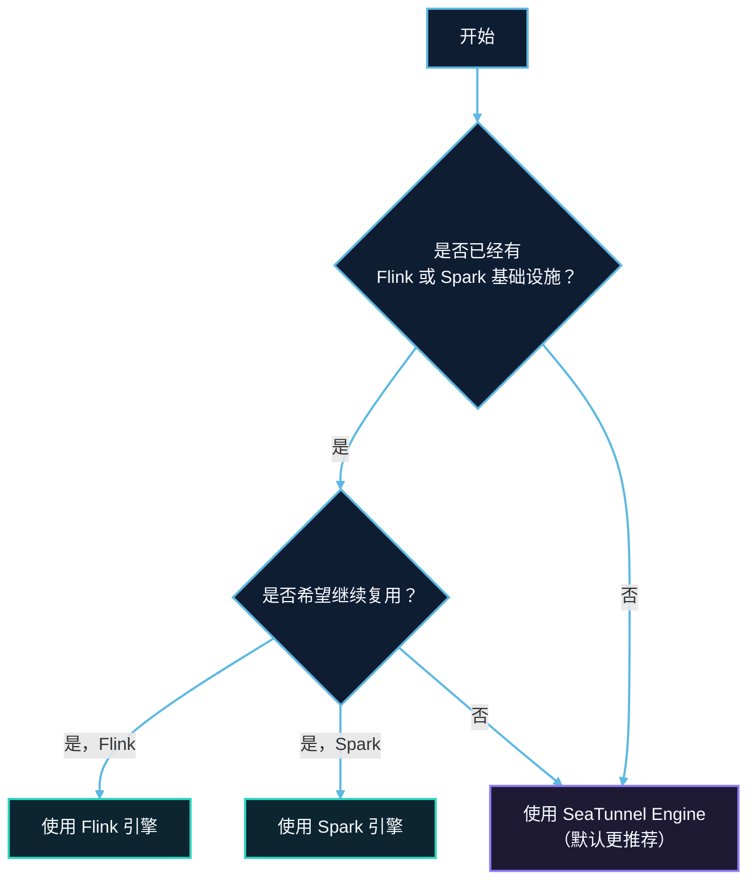

# 引擎概览

SeaTunnel 支持多种执行引擎，您可以根据实际场景选择最合适的引擎。本文档提供全面的对比分析，帮助您做出正确的选择。

## 先看选择建议

如果你是第一次评估 SeaTunnel，建议先用下面这条规则做初选，再看后面的完整对比：

- 如果你没有现成的 Flink 或 Spark 运维体系，优先从 **SeaTunnel Engine (Zeta)** 开始。
- 如果团队已经稳定运行 Flink 集群，并且希望复用现有体系，选择 **Flink**。
- 如果团队已经稳定运行 Spark，并且任务以批处理为主，选择 **Spark**。

对大多数新部署来说，SeaTunnel Engine 是默认推荐项，因为它的上手路径最短、运维负担更低，并且对 CDC、多表同步、数据库迁移这类数据同步场景支持更完整。

## 推荐阅读路径

- 我只想尽快跑通第一个任务：[快速入门总览](../getting-started/overview.md) -> [SeaTunnel Engine 简介](zeta/about.md) -> [SeaTunnel 引擎快速开始](../getting-started/locally/quick-start-seatunnel-engine.md)
- 我想先理解整体架构再选引擎：[关于 SeaTunnel](../introduction/about.md) -> [工作原理](../introduction/how-it-works.md) -> [架构概览](../architecture/overview.md)
- 我已经确定要复用现有平台：直接进入 [SeaTunnel Engine](zeta/about.md)、[Flink 引擎指南](flink.md) 或 [Spark 引擎指南](spark.md)

## 支持的引擎

| 引擎 | 描述 | 推荐场景 |
|------|------|---------|
| **SeaTunnel Engine (Zeta)** | 专为数据集成构建的原生引擎 | 新项目、数据同步 |
| **Apache Flink** | 分布式流处理引擎 | 已有 Flink 基础设施 |
| **Apache Spark** | 分布式批流处理引擎 | 已有 Spark 基础设施 |

## 快速对比

### 功能对比

| 功能 | SeaTunnel Engine | Flink | Spark |
|------|------------------|-------|-------|
| **批处理** | ✅ | ✅ | ✅ |
| **流处理** | ✅ | ✅ | ✅ |
| **CDC 支持** | ✅ | ✅ | ❌ |
| **精确一次** | ✅ | ✅ | ✅ |
| **多表同步** | ✅ | ✅ | ✅ |
| **Schema 演变** | ✅ | ✅ | ❌ |
| **REST API** | ✅ | ✅ | ❌ |
| **Web UI** | ✅ | ✅ | ✅ |
| **单机模式** | ✅ | ✅ | ✅ |
| **集群模式** | ✅ | ✅ | ✅ |

### 性能对比

| 指标 | SeaTunnel Engine | Flink | Spark |
|------|------------------|-------|-------|
| **吞吐量** | ⭐⭐⭐ 高 | ⭐⭐ 中 | ⭐⭐ 中 |
| **延迟** | ⭐⭐⭐ 低 | ⭐⭐⭐ 低 | ⭐⭐ 中 |
| **资源消耗** | ⭐⭐⭐ 低 | ⭐⭐ 中 | ⭐ 高 |
| **启动速度** | ⭐⭐⭐ 快 | ⭐⭐ 中 | ⭐ 慢 |

### 易用性对比

| 方面 | SeaTunnel Engine | Flink | Spark |
|------|------------------|-------|-------|
| **安装部署** | ⭐⭐⭐ 简单 | ⭐⭐ 中等 | ⭐⭐ 中等 |
| **配置复杂度** | ⭐⭐⭐ 简单 | ⭐⭐ 中等 | ⭐⭐ 中等 |
| **外部依赖** | ⭐⭐⭐ 无 | ⭐⭐ Zookeeper (可选) | ⭐ YARN/Mesos |
| **学习曲线** | ⭐⭐⭐ 平缓 | ⭐⭐ 中等 | ⭐⭐ 中等 |

## 引擎选择指南

### SeaTunnel Engine (Zeta) - 推荐

**适用场景：**
- 新的数据集成项目
- 数据同步和 CDC 场景
- 没有现有大数据基础设施的用户
- 需要低资源消耗的场景
- 大量小表的实时同步

**核心优势：**
- 无外部依赖（不需要 Zookeeper、HDFS）
- 专为数据同步场景优化
- 动态线程共享，高效利用资源
- Pipeline 级别的容错机制
- 内置集群管理和高可用
- JDBC 连接复用

**典型用例：**
- MySQL 到 ClickHouse 实时同步
- 多表 CDC 同步
- 数据库迁移项目

### Apache Flink

**适用场景：**
- 已有 Flink 基础设施的组织
- 复杂的流处理需求
- 需要与 Flink 生态集成的场景

**核心优势：**
- 成熟的流处理能力
- 丰富的生态系统和社区
- 高级状态管理
- 与 Flink SQL 集成

**典型用例：**
- 与现有 Flink 管道集成
- 复杂事件处理
- 需要 Flink 特定功能的场景

### Apache Spark

**适用场景：**
- 已有 Spark 基础设施的组织
- 大规模批处理
- 需要与 Spark 生态集成（MLlib、GraphX）

**核心优势：**
- 成熟的批处理能力
- 丰富的生态系统
- 与 Hive、HDFS 集成
- 支持 YARN、Kubernetes

**典型用例：**
- 大规模 ETL 作业
- 与现有 Spark 工作流集成
- 批量数据仓库加载

## 决策流程图



## 配置示例

### SeaTunnel Engine

```hocon
env {
  parallelism = 2
  job.mode = "STREAMING"
  checkpoint.interval = 10000
}
```

### Flink 引擎

```hocon
env {
  parallelism = 2
  job.mode = "STREAMING"
  checkpoint.interval = 10000
  flink.execution.checkpointing.mode = "EXACTLY_ONCE"
  flink.execution.checkpointing.timeout = 600000
}
```

### Spark 引擎

```hocon
env {
  parallelism = 2
  job.mode = "BATCH"
  spark.app.name = "SeaTunnel-Job"
  spark.executor.memory = "2g"
  spark.executor.instances = "2"
}
```

## 连接器兼容性

所有 SeaTunnel V2 连接器都与三种引擎兼容。但某些功能在不同引擎上可能有不同的行为：

| 连接器功能 | SeaTunnel Engine | Flink | Spark |
|-----------|------------------|-------|-------|
| CDC 连接器 | ✅ 完全支持 | ✅ 完全支持 | ❌ 不支持 |
| 精确一次写入 | ✅ 完全支持 | ✅ 完全支持 | ✅ 部分支持 |
| 多表读取 | ✅ 完全支持 | ✅ 完全支持 | ✅ 完全支持 |

## 迁移指南

### 从 Flink 迁移到 SeaTunnel Engine

1. 移除 Flink 特定配置（以 `flink.` 为前缀的配置）
2. 保留通用配置（`parallelism`、`checkpoint.interval`）
3. 使用 SeaTunnel Engine 测试

### 从 Spark 迁移到 SeaTunnel Engine

1. 移除 Spark 特定配置（以 `spark.` 为前缀的配置）
2. 保留通用配置（`parallelism`、`job.mode`）
3. 使用 SeaTunnel Engine 测试

## 总结

| 场景 | 推荐引擎 |
|------|---------|
| 没有大数据基础设施的新项目 | **SeaTunnel Engine** |
| CDC 和实时同步 | **SeaTunnel Engine** |
| 已有 Flink 基础设施 | **Flink** |
| 已有 Spark 基础设施 | **Spark** |
| 低资源环境 | **SeaTunnel Engine** |
| 复杂流处理 | **Flink** |
| 大规模批量 ETL | **Spark** |

## 下一步

- [SeaTunnel Engine 简介](zeta/about.md)
- [快速入门总览](../getting-started/overview.md)
- [SeaTunnel 引擎快速开始](../getting-started/locally/quick-start-seatunnel-engine.md)
- [Flink 引擎指南](flink.md)
- [Spark 引擎指南](spark.md)
