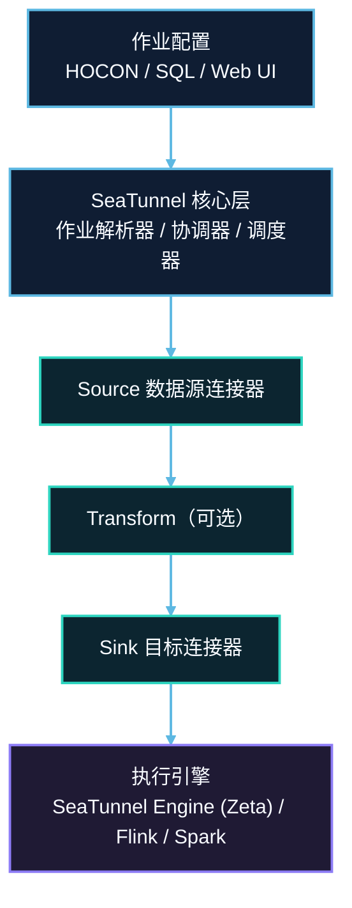
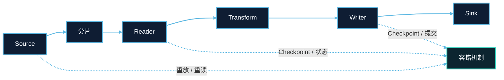

# 工作原理

## 概述

SeaTunnel 是一个分布式多模态数据集成工具，采用插件化架构。连接器层与执行引擎解耦，同一套连接器可在不同引擎上运行。

这一页适合作为“快速开始”和“架构章节”之间的桥接页。当你已经知道 SeaTunnel 是什么，但还没形成“作业配置、插件体系、执行引擎如何连起来”的整体模型时，建议先读这里。

## 推荐阅读路径

如果你希望先建立一套系统级理解，建议按下面顺序阅读：

- [快速入门总览](../getting-started/overview.md)，先拿到最短首跑路径
- 本页，先建立执行模型的整体图景
- [引擎概览](../engines/overview.md)，理解执行引擎如何选择
- [架构概览](../architecture/overview.md)，再进入更完整的分层视图
- [核心 API 设计](../architecture/core-api-design.md)，理解 connector 与元数据契约
- 如果你还需要理解数据集编排与 transform 行为，再看 [Transform 插件体系](../architecture/transform-plugin-system.md)

## 核心组件

### 1. Connector API

与引擎无关的统一 API，用于开发 Source、Transform、Sink 连接器。

| 组件 | 说明 |
|------|------|
| **Source** | 从外部系统读取数据（数据库、文件、消息队列） |
| **Transform** | 数据转换（字段映射、过滤、类型转换） |
| **Sink** | 将数据写入目标系统 |

### 2. 执行引擎

| 引擎 | 适用场景 |
|------|---------|
| **SeaTunnel Engine (Zeta)** | 数据同步、CDC、低资源消耗 |
| **Apache Flink** | 复杂流处理、已有 Flink 基础设施 |
| **Apache Spark** | 大规模批处理、已有 Spark 基础设施 |

### 3. 翻译层

将 SeaTunnel 统一 API 转换为引擎特定实现，实现连接器跨引擎复用。

## 数据流

**核心特性：**
- 基于分片的并行读取
- 分布式快照实现精确一次语义
- 自动故障转移和恢复

## 模块结构

| 模块 | 职责 |
|------|------|
| `seatunnel-api` | 核心 API 定义 |
| `seatunnel-connectors-v2` | Source 和 Sink 连接器 |
| `seatunnel-transforms-v2` | Transform 插件 |
| `seatunnel-engine` | SeaTunnel Engine (Zeta) |
| `seatunnel-translation` | Flink 和 Spark 的引擎适配器 |
| `seatunnel-core` | 作业提交与 CLI |
| `seatunnel-formats` | 数据格式处理 |
| `seatunnel-e2e` | 端到端测试 |

## 作业执行流程

1. **解析** - 读取并验证作业配置
2. **规划** - 生成带并行度的执行计划
3. **调度** - 将任务分发到 Worker 节点
4. **执行** - 运行 Source → Transform → Sink 管道
5. **监控** - 跟踪进度、指标和检查点

## 下一步

- [引擎对比](../engines/overview.md)
- [快速入门总览](../getting-started/overview.md)
- [SeaTunnel 引擎快速开始](../getting-started/locally/quick-start-seatunnel-engine.md)
- [架构概览](../architecture/overview.md)
- [连接器列表](../connectors)
